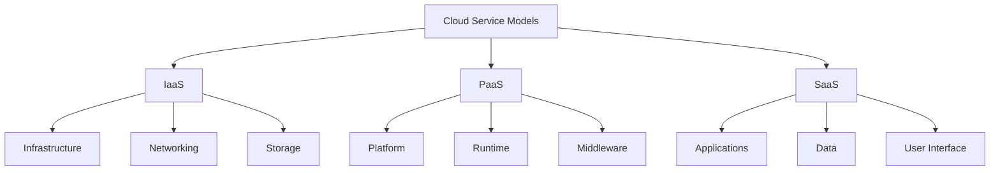
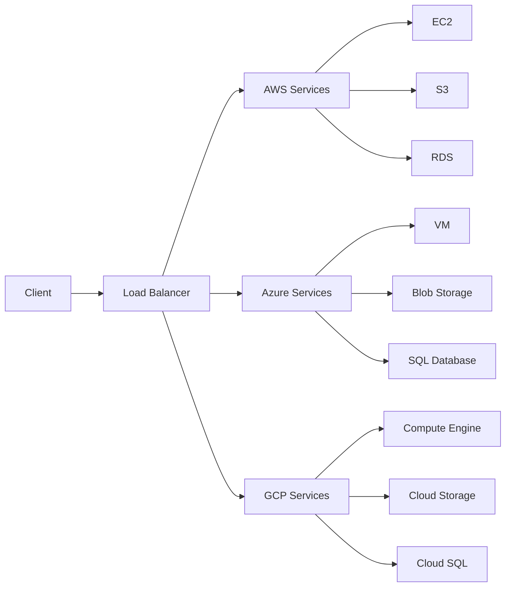

# Lesson 6.1: Cloud Computing Fundamentals

## Navigation
- [← Back to Module Overview](./README.md)
- [Next Lesson →](./6.2-aws-data-services.md)

## Learning Objectives
- Understand cloud computing models (IaaS, PaaS, SaaS)
- Learn about major cloud service providers
- Explore cloud architecture patterns
- Master cloud service selection

## Key Concepts

### Cloud Computing Models
- Infrastructure as a Service (IaaS)
  - Virtual machines
  - Storage
  - Networking
  - Security
- Platform as a Service (PaaS)
  - Development platforms
  - Database services
  - Analytics services
  - Integration services
- Software as a Service (SaaS)
  - Business applications
  - Collaboration tools
  - Analytics platforms
  - Development tools

### Cloud Service Providers
- Amazon Web Services (AWS)
  - Core services
  - Data services
  - Analytics capabilities
- Microsoft Azure
  - Core services
  - Data services
  - Analytics capabilities
- Google Cloud Platform (GCP)
  - Core services
  - Data services
  - Analytics capabilities

### Cloud Architecture Patterns
- Multi-cloud strategies
- Hybrid cloud solutions
- Serverless architecture
- Microservices design
- Data lake architecture

## Architecture Diagrams

### Cloud Service Model Comparison


### Multi-Cloud Architecture


## Configuration Examples

### AWS S3 Bucket Configuration
```yaml
Resources:
  DataBucket:
    Type: AWS::S3::Bucket
    Properties:
      BucketName: my-data-bucket
      VersioningConfiguration:
        Status: Enabled
      PublicAccessBlockConfiguration:
        BlockPublicAcls: true
        BlockPublicPolicy: true
        IgnorePublicAcls: true
        RestrictPublicBuckets: true
      CorsConfiguration:
        CorsRules:
          - AllowedHeaders: ['*']
            AllowedMethods: [GET, PUT, POST, DELETE]
            AllowedOrigins: ['https://my-domain.com']
            MaxAge: 3000
```

### Azure Storage Account Configuration
```yaml
resources:
  - type: Microsoft.Storage/storageAccounts
    name: mystorageaccount
    location: eastus
    properties:
      accountType: Standard_LRS
      supportsHttpsTrafficOnly: true
      minimumTlsVersion: TLS1_2
      networkAcls:
        defaultAction: Deny
        virtualNetworkRules:
          - virtualNetworkResourceId: /subscriptions/subscription-id/resourceGroups/rg/providers/Microsoft.Network/virtualNetworks/vnet
            action: Allow
```

## Best Practices

### Cloud Architecture Design
1. **High Availability**
   - Implement multi-region deployments
   - Use auto-scaling groups
   - Design for fault tolerance
   - Implement proper load balancing

2. **Security**
   - Follow the principle of least privilege
   - Implement proper IAM roles
   - Use encryption at rest and in transit
   - Regular security audits

3. **Cost Optimization**
   - Right-size resources
   - Use reserved instances
   - Implement auto-scaling
   - Monitor and optimize storage

4. **Performance**
   - Use CDN for static content
   - Implement caching strategies
   - Optimize database queries
   - Use appropriate instance types

## Real-World Case Studies

### Case Study 1: E-commerce Platform Migration
- **Challenge**: Migrate legacy on-premise e-commerce platform to cloud
- **Solution**: 
  - Implemented multi-region deployment for global customers
  - Used auto-scaling for handling peak traffic
  - Implemented CDN for static content
  - Used managed database services
- **Results**:
  - 60% reduction in infrastructure costs
  - 99.99% uptime
  - 50% improvement in page load times
  - Reduced maintenance overhead

### Case Study 2: Data Analytics Platform
- **Challenge**: Build scalable data analytics platform
- **Solution**:
  - Implemented data lake architecture
  - Used serverless computing for ETL jobs
  - Implemented proper data governance
  - Used managed analytics services
- **Results**:
  - 70% faster data processing
  - Improved data quality
  - Reduced operational costs
  - Better compliance with regulations

## Best Practices
- Choose appropriate cloud models
- Design for scalability
- Implement security first
- Consider cost optimization
- Plan for disaster recovery

## Common Pitfalls
- Over-provisioning resources
- Poor security configuration
- Vendor lock-in
- Cost management issues
- Performance bottlenecks

## Additional Resources
- Cloud Computing Guide
- Service Provider Documentation
- Architecture Patterns Guide
- Cost Optimization Guide

## Next Steps
- Learn about specific cloud services
- Explore advanced architecture patterns
- Practice with real scenarios
- Understand pricing models 