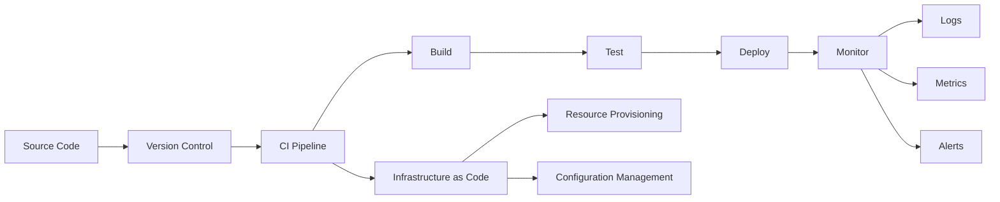
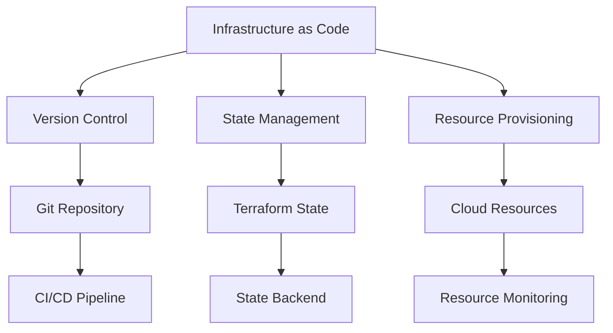

# Lesson 6.10: DevOps Integration

## Navigation
- [← Back to Module Overview](./README.md)
- [Previous Lesson ←](./6.9-cloud-certifications.md)
- [Next Module →](../07-data-modeling-and-database-design/README.md)

## Learning Objectives
- Understand DevOps principles
- Master CI/CD implementation
- Learn about infrastructure automation
- Practice DevOps workflows

## Key Concepts

### DevOps Framework
- Continuous Integration
  - Source Control
  - Build Automation
  - Testing
  - Code Quality
- Continuous Deployment
  - Release Management
  - Environment Management
  - Deployment Automation
  - Monitoring
- Infrastructure as Code
  - Resource Provisioning
  - Configuration Management
  - State Management
  - Version Control

### DevOps Tools
- Version Control
  - Git
  - GitHub/GitLab
  - Bitbucket
- CI/CD Tools
  - Jenkins
  - GitHub Actions
  - GitLab CI
- Infrastructure Tools
  - Terraform
  - Ansible
  - CloudFormation
- Monitoring Tools
  - Prometheus
  - Grafana
  - ELK Stack

## Architecture Diagrams

### DevOps Pipeline Architecture


### Infrastructure Management Architecture


## Configuration Examples

### CI/CD Pipeline Configuration
```yaml
pipeline:
  stages:
    - build
    - test
    - deploy
    - monitor
  
  build:
    steps:
      - checkout_code
      - install_dependencies
      - build_artifacts
      - run_tests
  
  deploy:
    environments:
      - development
      - staging
      - production
    steps:
      - validate_config
      - deploy_infrastructure
      - deploy_application
      - health_check
  
  monitor:
    metrics:
      - performance
      - availability
      - errors
    alerts:
      - threshold_violations
      - service_health
      - resource_usage
```

### Infrastructure Configuration
```yaml
infrastructure:
  providers:
    - aws
    - azure
    - gcp
  
  resources:
    compute:
      - instances
      - containers
      - serverless
    storage:
      - databases
      - object_storage
      - file_systems
    networking:
      - vpc
      - load_balancers
      - dns
  
  security:
    - iam
    - encryption
    - compliance
```

## Best Practices

### DevOps Implementation
1. **Pipeline Management**
   - Automated workflows
   - Version control
   - Testing automation
   - Deployment strategies

2. **Infrastructure Management**
   - Infrastructure as Code
   - State management
   - Resource provisioning
   - Configuration management

3. **Monitoring and Observability**
   - Metrics collection
   - Log management
   - Alert configuration
   - Performance monitoring

4. **Security and Compliance**
   - Access control
   - Secret management
   - Compliance checks
   - Security scanning

## Real-World Case Studies

### Case Study 1: Microservices Deployment
- **Challenge**: Complex deployment process
- **Solution**:
  - Automated CI/CD pipeline
  - Infrastructure as Code
  - Container orchestration
  - Monitoring integration
- **Results**:
  - Faster deployments
  - Reduced errors
  - Better scalability
  - Improved monitoring

### Case Study 2: Multi-Cloud Infrastructure
- **Challenge**: Multi-cloud management
- **Solution**:
  - Unified IaC approach
  - Cross-cloud deployment
  - Centralized monitoring
  - Automated compliance
- **Results**:
  - Simplified management
  - Cost optimization
  - Better reliability
  - Enhanced security

## Common Pitfalls
- Poor pipeline design
- Manual interventions
- State management issues
- Monitoring gaps
- Security misconfigurations

## Additional Resources
- DevOps Tools
- Best Practices Guides
- Architecture Patterns
- Security Guidelines

## Next Steps
- Design CI/CD pipeline
- Implement IaC
- Set up monitoring
- Automate workflows 