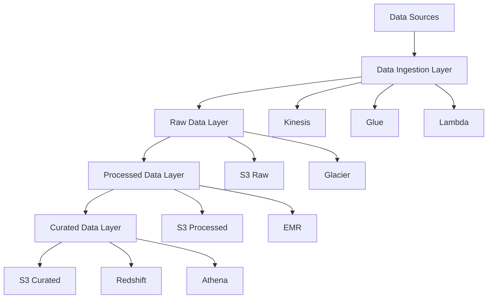
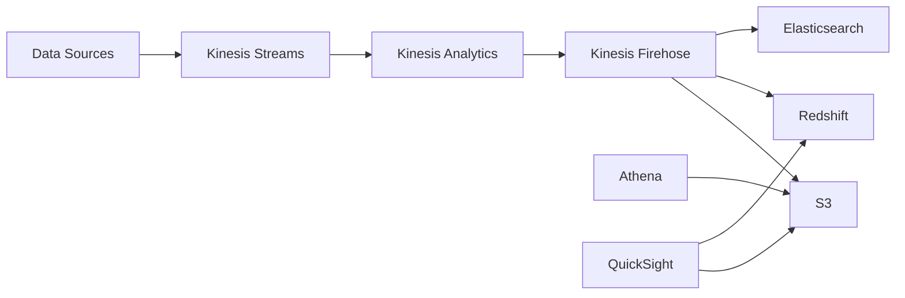

# Lesson 6.2: AWS Data Services

## Navigation
- [← Back to Module Overview](./README.md)
- [Previous Lesson ←](./6.1-cloud-computing-fundamentals.md)
- [Next Lesson →](./6.3-azure-and-gcp-data-services.md)

## Learning Objectives
- Master AWS data services ecosystem
- Learn about data lake architecture
- Understand AWS data pipeline services
- Practice AWS service implementation

## Detailed Content
- [Read the detailed content here](./lectures/lesson-6-2.md)


## Key Concepts

### AWS Data Stack
- Storage Services
  - Amazon S3
  - Amazon EBS
  - Amazon EFS
  - Amazon Glacier
- Database Services
  - Amazon RDS
  - Amazon DynamoDB
  - Amazon Redshift
  - Amazon Neptune
- Analytics Services
  - Amazon EMR
  - Amazon Athena
  - Amazon QuickSight
  - Amazon Kinesis
- Data Pipeline Services
  - AWS Glue
  - AWS Data Pipeline
  - Amazon ECS
  - AWS Lambda

### Data Lake Architecture
- Data Ingestion
  - Streaming data
  - Batch data
  - Real-time data
- Data Storage
  - Raw data layer
  - Processed data layer
  - Curated data layer
- Data Processing
  - ETL/ELT pipelines
  - Data transformation
  - Data quality
- Data Access
  - Query interfaces
  - API endpoints
  - Visualization tools

## Architecture Diagrams

### AWS Data Lake Architecture


### Real-time Data Processing Pipeline


## Configuration Examples

### AWS Glue Job Configuration
```yaml
Resources:
  GlueJob:
    Type: AWS::Glue::Job
    Properties:
      Name: etl-job
      Role: !GetAtt GlueRole.Arn
      Command:
        Name: glueetl
        ScriptLocation: s3://my-bucket/scripts/etl.py
      DefaultArguments:
        "--job-language": "python"
        "--continuous-log-logGroup": "/aws-glue/jobs/"
        "--enable-continuous-cloudwatch-log": "true"
      MaxRetries: 0
      Timeout: 2880
      GlueVersion: "3.0"
```

### Amazon Redshift Cluster Configuration
```yaml
Resources:
  RedshiftCluster:
    Type: AWS::Redshift::Cluster
    Properties:
      ClusterIdentifier: my-redshift-cluster
      NodeType: dc2.large
      NumberOfNodes: 2
      MasterUsername: admin
      MasterUserPassword: !Ref MasterUserPassword
      VpcSecurityGroupIds: 
        - !Ref SecurityGroup
      ClusterSubnetGroupName: !Ref SubnetGroup
      PubliclyAccessible: false
      Encrypted: true
      EnhancedVpcRouting: true
```

## Best Practices

### Data Lake Implementation
1. **Data Organization**
   - Use clear folder structure
   - Implement data partitioning
   - Use appropriate file formats
   - Implement data versioning

2. **Security**
   - Implement proper IAM roles
   - Use encryption at rest
   - Implement VPC endpoints
   - Regular security audits

3. **Performance**
   - Use appropriate file formats
   - Implement data partitioning
   - Use caching effectively
   - Optimize query patterns

4. **Cost Management**
   - Use appropriate storage classes
   - Implement lifecycle policies
   - Monitor usage patterns
   - Optimize compute resources

## Real-World Case Studies

### Case Study 1: Financial Data Lake
- **Challenge**: Build a secure and compliant data lake for financial data
- **Solution**:
  - Implemented multi-account architecture
  - Used AWS Lake Formation for governance
  - Implemented fine-grained access control
  - Used AWS Macie for sensitive data discovery
- **Results**:
  - Improved data security
  - Better compliance with regulations
  - Reduced data access time
  - Lower operational costs

### Case Study 2: Real-time Analytics Platform
- **Challenge**: Build real-time analytics platform for IoT data
- **Solution**:
  - Used Kinesis for data ingestion
  - Implemented Kinesis Analytics for processing
  - Used Kinesis Firehose for data delivery
  - Implemented proper error handling
- **Results**:
  - Sub-second latency
  - 99.99% uptime
  - Scalable to millions of events
  - Cost-effective solution

## Best Practices
- Use appropriate storage classes
- Implement proper IAM roles
- Monitor costs and usage
- Follow security best practices
- Implement error handling

## Common Pitfalls
- Incorrect IAM permissions
- Poor cost management
- Inefficient data formats
- Missing monitoring
- Security misconfigurations

## Additional Resources
- AWS Data Services Documentation
- Data Lake Best Practices
- AWS Security Guide
- Cost Optimization Guide

## Next Steps
- Learn about advanced AWS services
- Explore data lake patterns
- Practice with real scenarios
- Understand pricing models 