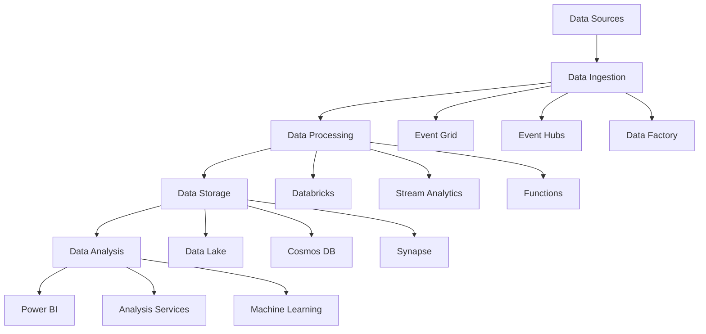
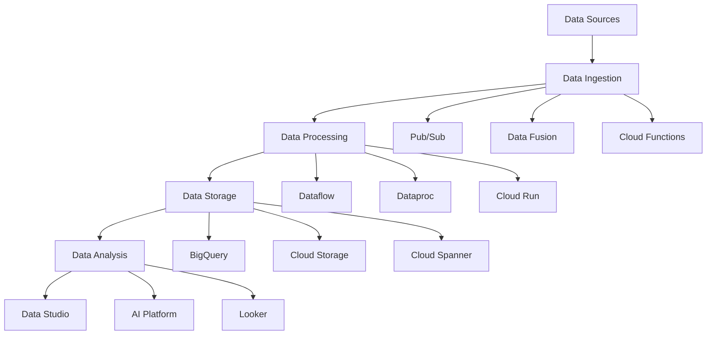

# Lesson 6.3: Azure and GCP Data Services

## Navigation
- [← Back to Module Overview](./README.md)
- [Previous Lesson ←](./6.2-aws-data-services.md)
- [Next Lesson →](./6.4-data-security-fundamentals.md)

## Learning Objectives
- Understand Azure data services ecosystem
- Master GCP data services platform
- Learn about multi-cloud data strategies
- Practice cloud service implementation

## Detailed Content
- [Read the detailed content here](./lectures/lesson-6-3.md)


## Key Concepts

### Azure Data Stack
- Storage Services
  - Azure Blob Storage
  - Azure Data Lake Storage
  - Azure Files
  - Azure Archive Storage
- Database Services
  - Azure SQL Database
  - Azure Cosmos DB
  - Azure Synapse Analytics
  - Azure Database for PostgreSQL
- Analytics Services
  - Azure Databricks
  - Azure HDInsight
  - Azure Stream Analytics
  - Azure Analysis Services
- Data Pipeline Services
  - Azure Data Factory
  - Azure Functions
  - Azure Logic Apps
  - Azure Event Grid

### GCP Data Stack
- Storage Services
  - Cloud Storage
  - Cloud Bigtable
  - Cloud SQL
  - Cloud Spanner
- Analytics Services
  - BigQuery
  - Dataflow
  - Dataproc
  - Cloud Composer
- Data Pipeline Services
  - Cloud Data Fusion
  - Cloud Functions
  - Cloud Run
  - Cloud Pub/Sub

## Architecture Diagrams

### Azure Data Platform Architecture


### GCP Data Platform Architecture


## Configuration Examples

### Azure Data Factory Pipeline
```yaml
{
  "name": "ETL-Pipeline",
  "properties": {
    "activities": [
      {
        "name": "CopyActivity",
        "type": "Copy",
        "dependsOn": [],
        "policy": {
          "timeout": "7.00:00:00",
          "retry": 0,
          "retryIntervalInSeconds": 30,
          "secureOutput": false,
          "secureInput": false
        },
        "userProperties": [],
        "typeProperties": {
          "source": {
            "type": "BlobSource",
            "recursive": true
          },
          "sink": {
            "type": "SqlSink",
            "writeBehavior": "insert"
          }
        },
        "inputs": [
          {
            "referenceName": "SourceDataset",
            "type": "DatasetReference"
          }
        ],
        "outputs": [
          {
            "referenceName": "SinkDataset",
            "type": "DatasetReference"
          }
        ]
      }
    ]
  }
}
```

### GCP Dataflow Job Configuration
```yaml
name: "ETL-Pipeline"
description: "ETL pipeline for data processing"
parameters:
  - name: "inputPath"
    type: "string"
    description: "Input file path"
  - name: "outputPath"
    type: "string"
    description: "Output file path"
defaultEnvironment:
  workerMachineType: "n1-standard-4"
  numWorkers: 2
  maxWorkers: 10
  tempLocation: "gs://my-bucket/temp"
  zone: "us-central1-a"
```

## Best Practices

### Multi-Cloud Data Strategy
1. **Data Integration**
   - Use cloud-agnostic formats
   - Implement data replication
   - Handle data consistency
   - Manage data latency

2. **Cost Optimization**
   - Monitor usage patterns
   - Use appropriate services
   - Implement auto-scaling
   - Optimize storage costs

3. **Security**
   - Implement proper IAM
   - Use encryption
   - Monitor access patterns
   - Regular security audits

4. **Performance**
   - Optimize data formats
   - Use caching effectively
   - Implement partitioning
   - Monitor performance metrics

## Real-World Case Studies

### Case Study 1: Multi-Cloud Data Platform
- **Challenge**: Build a resilient data platform across Azure and GCP
- **Solution**:
  - Used Azure Data Factory for orchestration
  - Implemented GCP Dataflow for processing
  - Used cloud-agnostic storage formats
  - Implemented proper monitoring
- **Results**:
  - Improved reliability
  - Better cost optimization
  - Enhanced scalability
  - Reduced vendor lock-in

### Case Study 2: Real-time Analytics Solution
- **Challenge**: Build real-time analytics across clouds
- **Solution**:
  - Used Azure Event Hubs for ingestion
  - Implemented GCP Pub/Sub for messaging
  - Used Azure Stream Analytics for processing
  - Implemented BigQuery for analysis
- **Results**:
  - Sub-second latency
  - High availability
  - Cost-effective solution
  - Scalable architecture

## Common Pitfalls
- Vendor lock-in
- Data consistency issues
- Cost overruns
- Security misconfigurations
- Performance bottlenecks

## Additional Resources
- Azure Data Services Documentation
- GCP Data Services Documentation
- Multi-Cloud Best Practices
- Cost Optimization Guide

## Next Steps
- Learn about advanced cloud services
- Explore multi-cloud patterns
- Practice with real scenarios
- Understand pricing models 