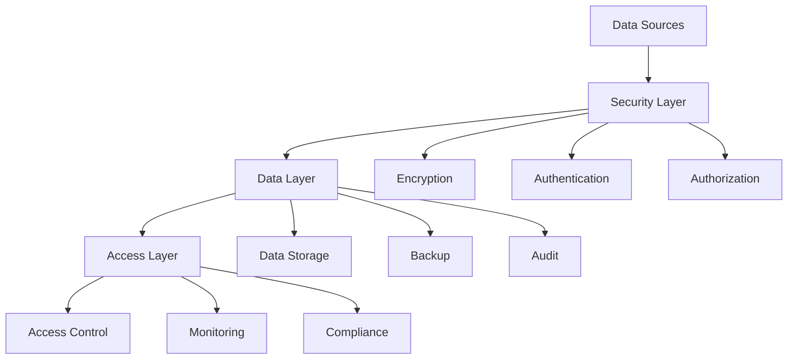
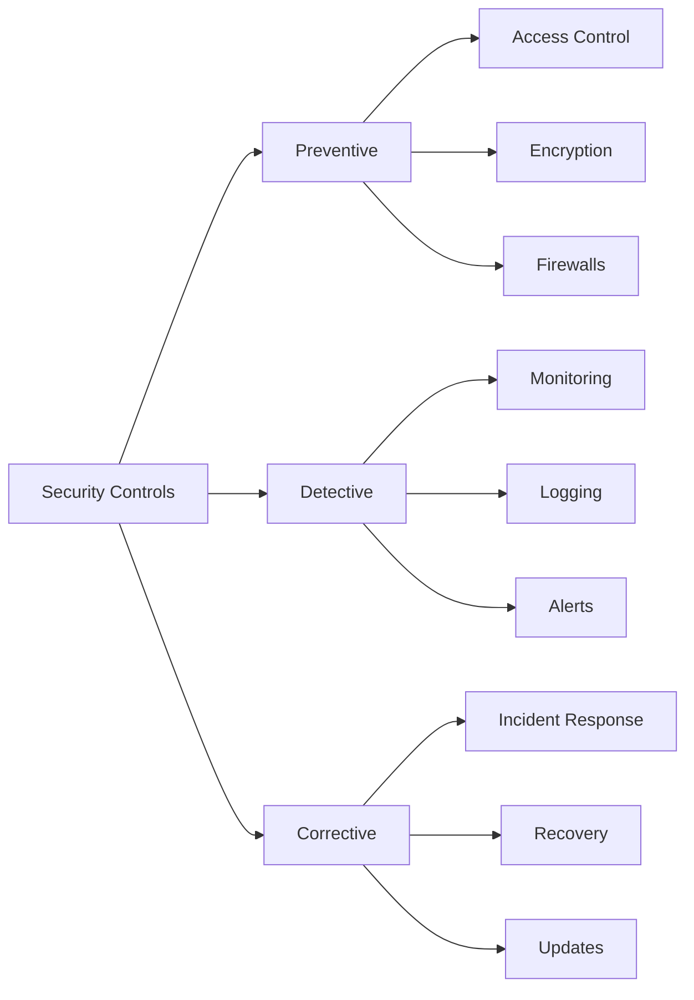

# Lesson 6.4: Data Security Fundamentals

## Navigation
- [← Back to Module Overview](./README.md)
- [Previous Lesson ←](./6.3-azure-and-gcp-data-services.md)
- [Next Lesson →](./6.5-compliance-and-governance.md)

## Learning Objectives
- Understand data security principles
- Master encryption techniques
- Learn about access control
- Practice security implementation

## Key Concepts

### Data Security Principles
- Confidentiality
  - Data encryption
  - Access control
  - Data masking
  - Secure transmission
- Integrity
  - Data validation
  - Checksums
  - Digital signatures
  - Audit trails
- Availability
  - Backup strategies
  - Disaster recovery
  - High availability
  - Business continuity

### Security Controls
- Physical Security
  - Data center security
  - Hardware security
  - Environmental controls
  - Access controls
- Logical Security
  - Authentication
  - Authorization
  - Encryption
  - Network security
- Administrative Security
  - Policies
  - Procedures
  - Training
  - Compliance

## Architecture Diagrams

### Data Security Architecture


### Security Control Framework


## Configuration Examples

### Encryption Configuration
```yaml
encryption:
  at_rest:
    algorithm: AES-256
    key_rotation: 90_days
    key_management: KMS
  in_transit:
    protocol: TLS 1.3
    cipher_suites:
      - TLS_AES_256_GCM_SHA384
      - TLS_CHACHA20_POLY1305_SHA256
    certificate_management:
      rotation: 365_days
      validation: strict
```

### Access Control Policy
```yaml
access_control:
  authentication:
    method: OAuth2
    mfa_required: true
    session_timeout: 3600
  authorization:
    model: RBAC
    roles:
      - admin
      - analyst
      - viewer
    permissions:
      admin:
        - read
        - write
        - delete
        - manage
      analyst:
        - read
        - write
      viewer:
        - read
```

## Best Practices

### Data Protection
1. **Encryption**
   - Use strong algorithms
   - Implement key rotation
   - Secure key storage
   - Monitor encryption status

2. **Access Control**
   - Implement least privilege
   - Use role-based access
   - Regular access reviews
   - Monitor access patterns

3. **Data Handling**
   - Secure data transmission
   - Implement data masking
   - Regular backups
   - Data lifecycle management

4. **Monitoring**
   - Real-time monitoring
   - Log analysis
   - Alert management
   - Incident response

## Real-World Case Studies

### Case Study 1: Financial Data Protection
- **Challenge**: Secure sensitive financial data
- **Solution**:
  - Implemented end-to-end encryption
  - Used hardware security modules
  - Implemented strict access controls
  - Regular security audits
- **Results**:
  - Improved data security
  - Better compliance
  - Reduced risk
  - Enhanced trust

### Case Study 2: Healthcare Data Security
- **Challenge**: Protect patient health information
- **Solution**:
  - Implemented HIPAA controls
  - Used data masking
  - Implemented audit trails
  - Regular training
- **Results**:
  - HIPAA compliance
  - Better data protection
  - Improved patient trust
  - Reduced breaches

## Common Pitfalls
- Weak encryption
- Poor key management
- Insufficient access controls
- Missing monitoring
- Inadequate training

## Additional Resources
- Security Standards
- Compliance Guidelines
- Best Practices Guide
- Incident Response Plan

## Next Steps
- Learn about advanced security
- Explore compliance requirements
- Practice security implementation
- Understand risk management 