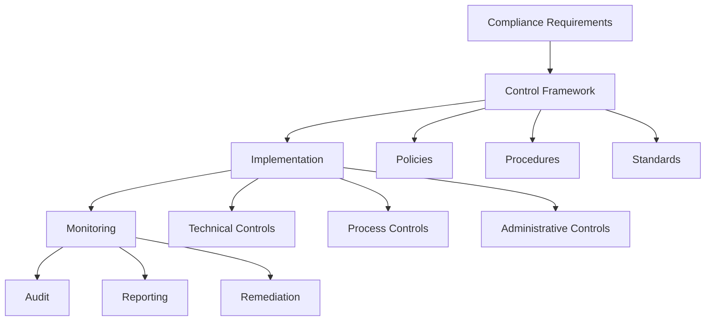
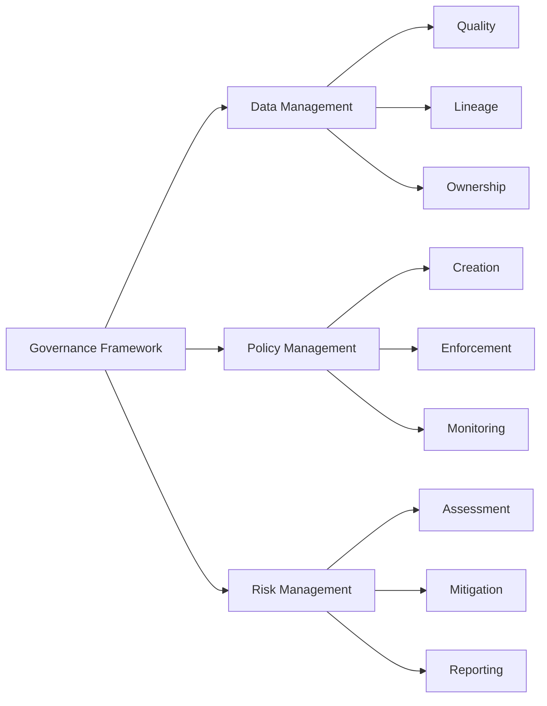

# Lesson 6.5: Compliance and Governance

## Navigation
- [← Back to Module Overview](./README.md)
- [Previous Lesson ←](./6.4-data-security-fundamentals.md)
- [Next Lesson →](./6.6-security-monitoring.md)

## Learning Objectives
- Understand compliance requirements
- Master data governance principles
- Learn about audit management
- Practice compliance implementation

## Detailed Content
- [Read the detailed content here](./lectures/lesson-6-5.md)

## Key Concepts

### Compliance Framework
- Regulatory Requirements
  - GDPR
  - HIPAA
  - PCI DSS
  - SOX
- Industry Standards
  - ISO 27001
  - NIST
  - COBIT
  - ITIL
- Data Protection
  - Data classification
  - Data retention
  - Data privacy
  - Data sovereignty

### Governance Framework
- Data Governance
  - Data quality
  - Data lineage
  - Data ownership
  - Data stewardship
- Policy Management
  - Policy creation
  - Policy enforcement
  - Policy monitoring
  - Policy updates
- Risk Management
  - Risk assessment
  - Risk mitigation
  - Risk monitoring
  - Risk reporting

## Architecture Diagrams

### Compliance Framework Architecture


### Governance Framework Architecture


## Configuration Examples

### Compliance Policy Configuration
```yaml
compliance:
  framework:
    name: GDPR
    version: "2.0"
    requirements:
      - data_protection
      - privacy_rights
      - data_portability
      - breach_notification
  controls:
    technical:
      - encryption
      - access_control
      - audit_logging
    administrative:
      - training
      - documentation
      - procedures
    physical:
      - security
      - environmental
      - access
```

### Data Governance Policy
```yaml
governance:
  data_management:
    quality:
      standards:
        - completeness
        - accuracy
        - timeliness
      monitoring:
        frequency: daily
        thresholds:
          completeness: 95%
          accuracy: 99%
    lineage:
      tracking: true
      retention: 7_years
    ownership:
      roles:
        - data_owner
        - data_steward
        - data_custodian
```

## Best Practices

### Compliance Management
1. **Policy Implementation**
   - Regular policy reviews
   - Clear documentation
   - Training programs
   - Enforcement mechanisms

2. **Control Framework**
   - Risk-based approach
   - Regular assessments
   - Gap analysis
   - Remediation plans

3. **Monitoring**
   - Continuous monitoring
   - Regular audits
   - Incident response
   - Reporting mechanisms

4. **Documentation**
   - Policy documentation
   - Control documentation
   - Audit documentation
   - Training materials

## Real-World Case Studies

### Case Study 1: GDPR Compliance
- **Challenge**: Implement GDPR compliance
- **Solution**:
  - Data mapping exercise
  - Privacy impact assessment
  - Technical controls
  - Training program
- **Results**:
  - GDPR compliance
  - Better data protection
  - Improved transparency
  - Enhanced trust

### Case Study 2: Healthcare Compliance
- **Challenge**: HIPAA compliance
- **Solution**:
  - Security assessment
  - Policy implementation
  - Technical controls
  - Regular training
- **Results**:
  - HIPAA compliance
  - Better security
  - Improved processes
  - Reduced risks

## Common Pitfalls
- Incomplete documentation
- Insufficient training
- Poor monitoring
- Inadequate controls
- Missing updates

## Additional Resources
- Compliance Standards
- Governance Frameworks
- Best Practices Guide
- Audit Guidelines

## Next Steps
- Learn about advanced compliance
- Explore governance frameworks
- Practice implementation
- Understand risk management 