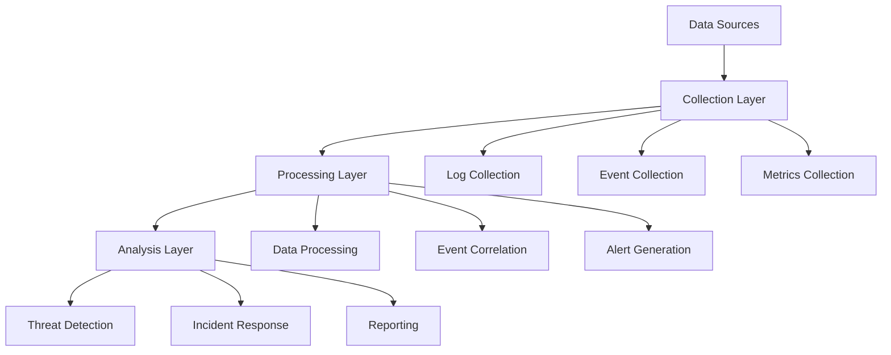
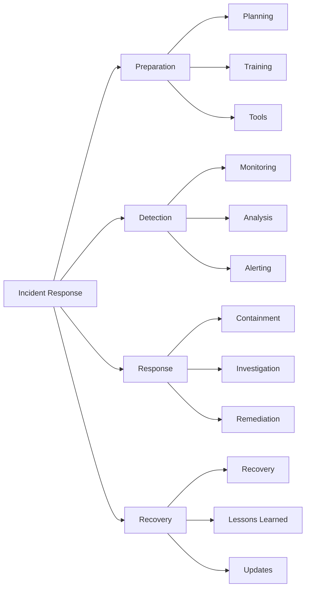

# Lesson 6.6: Security Monitoring

## Navigation
- [← Back to Module Overview](./README.md)
- [Previous Lesson ←](./6.5-compliance-and-governance.md)
- [Next Lesson →](./6.7-docker-fundamentals.md)

## Learning Objectives
- Understand security monitoring principles
- Master monitoring tools and techniques
- Learn about incident response
- Practice monitoring implementation

## Key Concepts

### Monitoring Framework
- Log Management
  - Log collection
  - Log analysis
  - Log retention
  - Log correlation
- Security Monitoring
  - Threat detection
  - Vulnerability scanning
  - Intrusion detection
  - Security analytics
- Incident Response
  - Incident detection
  - Incident analysis
  - Incident containment
  - Incident recovery

### Monitoring Tools
- SIEM Systems
  - Log aggregation
  - Event correlation
  - Alert management
  - Reporting
- Security Tools
  - IDS/IPS
  - Firewall monitoring
  - Endpoint protection
  - Network monitoring
- Analytics Tools
  - Threat intelligence
  - Behavior analytics
  - Machine learning
  - Predictive analytics

## Architecture Diagrams

### Security Monitoring Architecture


### Incident Response Framework


## Configuration Examples

### SIEM Configuration
```yaml
siem:
  collection:
    sources:
      - type: syslog
        format: rfc5424
        retention: 90_days
      - type: windows_event
        format: evtx
        retention: 90_days
      - type: application_log
        format: json
        retention: 90_days
  processing:
    correlation:
      rules:
        - name: failed_login
          threshold: 5
          timeframe: 5_minutes
        - name: suspicious_activity
          threshold: 3
          timeframe: 1_hour
    alerts:
      severity_levels:
        - critical
        - high
        - medium
        - low
```

### Monitoring Dashboard Configuration
```yaml
dashboard:
  security_overview:
    metrics:
      - name: threat_detection
        type: gauge
        threshold: 95%
      - name: incident_response
        type: gauge
        threshold: 90%
      - name: system_health
        type: gauge
        threshold: 98%
  alerts:
    display:
      - severity
      - source
      - timestamp
      - status
    actions:
      - notify
      - escalate
      - remediate
```

## Best Practices

### Security Monitoring
1. **Log Management**
   - Centralized collection
   - Proper retention
   - Regular analysis
   - Secure storage

2. **Threat Detection**
   - Real-time monitoring
   - Pattern recognition
   - Anomaly detection
   - Threat intelligence

3. **Incident Response**
   - Clear procedures
   - Team coordination
   - Documentation
   - Regular drills

4. **Reporting**
   - Regular reports
   - Trend analysis
   - Performance metrics
   - Compliance status

## Real-World Case Studies

### Case Study 1: Enterprise Security Monitoring
- **Challenge**: Implement comprehensive security monitoring
- **Solution**:
  - Deployed SIEM system
  - Implemented log collection
  - Set up alerting
  - Created response procedures
- **Results**:
  - Better threat detection
  - Faster incident response
  - Improved security posture
  - Reduced incidents

### Case Study 2: Cloud Security Monitoring
- **Challenge**: Monitor multi-cloud environment
- **Solution**:
  - Cloud-native monitoring
  - Centralized logging
  - Automated alerts
  - Integrated response
- **Results**:
  - Better visibility
  - Faster detection
  - Improved response
  - Cost optimization

## Common Pitfalls
- Poor log management
- Inadequate monitoring
- Delayed response
- Missing documentation
- Insufficient training

## Additional Resources
- Security Standards
- Monitoring Tools
- Best Practices Guide
- Incident Response Plan

## Next Steps
- Learn about advanced monitoring
- Explore security tools
- Practice implementation
- Understand threat detection 