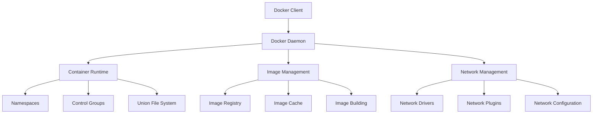
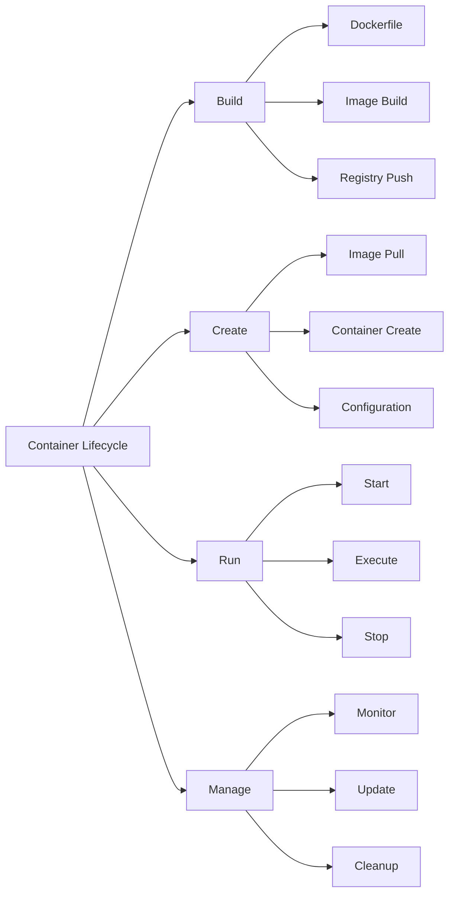

# Lesson 6.7: Docker Fundamentals

## Navigation
- [← Back to Module Overview](./README.md)
- [Previous Lesson ←](./6.6-security-monitoring.md)
- [Next Lesson →](./6.8-kubernetes-orchestration.md)

## Learning Objectives
- Understand container concepts
- Master Docker architecture
- Learn about container management
- Practice Docker implementation

## Key Concepts

### Container Fundamentals
- Container Architecture
  - Container engine
  - Container runtime
  - Container image
  - Container registry
- Container Components
  - Namespaces
  - Control groups
  - Union file system
  - Container networking
- Container Lifecycle
  - Image building
  - Container creation
  - Container running
  - Container management

### Docker Components
- Docker Engine
  - Docker daemon
  - Docker client
  - Docker API
  - Docker CLI
- Docker Images
  - Image layers
  - Image registry
  - Image tagging
  - Image building
- Docker Containers
  - Container configuration
  - Container networking
  - Container storage
  - Container security

## Architecture Diagrams

### Docker Architecture


### Container Lifecycle


## Configuration Examples

### Dockerfile Configuration
```yaml
# Base image
FROM python:3.9-slim

# Set working directory
WORKDIR /app

# Copy requirements
COPY requirements.txt .

# Install dependencies
RUN pip install --no-cache-dir -r requirements.txt

# Copy application code
COPY . .

# Set environment variables
ENV PYTHONUNBUFFERED=1
ENV PORT=8000

# Expose port
EXPOSE 8000

# Run application
CMD ["python", "app.py"]
```

### Docker Compose Configuration
```yaml
version: '3.8'

services:
  web:
    build: .
    ports:
      - "8000:8000"
    environment:
      - DATABASE_URL=postgresql://user:password@db:5432/dbname
    depends_on:
      - db
    volumes:
      - .:/app
    networks:
      - app-network

  db:
    image: postgres:13
    environment:
      - POSTGRES_USER=user
      - POSTGRES_PASSWORD=password
      - POSTGRES_DB=dbname
    volumes:
      - postgres_data:/var/lib/postgresql/data
    networks:
      - app-network

volumes:
  postgres_data:

networks:
  app-network:
    driver: bridge
```

## Best Practices

### Container Management
1. **Image Management**
   - Use multi-stage builds
   - Optimize image size
   - Regular updates
   - Security scanning

2. **Container Configuration**
   - Resource limits
   - Health checks
   - Logging
   - Monitoring

3. **Security**
   - Non-root user
   - Security scanning
   - Regular updates
   - Access control

4. **Performance**
   - Resource optimization
   - Caching
   - Network optimization
   - Storage management

## Real-World Case Studies

### Case Study 1: Microservices Migration
- **Challenge**: Migrate monolithic application to containers
- **Solution**:
  - Containerized services
  - Docker Compose setup
  - Service discovery
  - Load balancing
- **Results**:
  - Better scalability
  - Easier deployment
  - Improved maintenance
  - Cost reduction

### Case Study 2: Development Environment
- **Challenge**: Standardize development environment
- **Solution**:
  - Docker development setup
  - Shared configurations
  - Local testing
  - CI/CD integration
- **Results**:
  - Consistent environment
  - Faster onboarding
  - Better collaboration
  - Reduced issues

## Common Pitfalls
- Large image sizes
- Poor resource management
- Security misconfigurations
- Missing monitoring
- Inefficient builds

## Additional Resources
- Docker Documentation
- Container Standards
- Best Practices Guide
- Security Guidelines

## Next Steps
- Learn about advanced Docker features
- Explore container orchestration
- Practice implementation
- Understand container security 