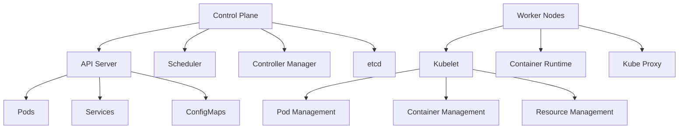
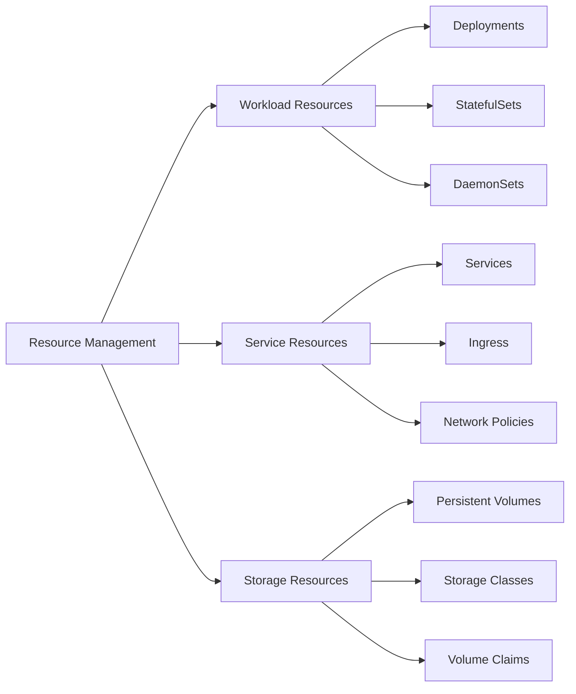

# Lesson 6.8: Kubernetes Orchestration

## Navigation
- [← Back to Module Overview](./README.md)
- [Previous Lesson ←](./6.7-docker-fundamentals.md)
- [Next Lesson →](./6.9-cloud-certifications.md)

## Learning Objectives
- Understand Kubernetes architecture
- Master cluster management
- Learn about resource management
- Practice Kubernetes implementation

## Key Concepts

### Kubernetes Architecture
- Control Plane
  - API Server
  - Scheduler
  - Controller Manager
  - etcd
- Worker Nodes
  - Kubelet
  - Container Runtime
  - Kube Proxy
  - Pod Management
- Cluster Components
  - Pods
  - Services
  - Volumes
  - ConfigMaps

### Resource Management
- Workload Resources
  - Deployments
  - StatefulSets
  - DaemonSets
  - Jobs
- Service Resources
  - Services
  - Ingress
  - Network Policies
  - Service Mesh
- Storage Resources
  - Persistent Volumes
  - Storage Classes
  - Volume Claims
  - Storage Provisioning

## Architecture Diagrams

### Kubernetes Architecture


### Resource Management Architecture


## Configuration Examples

### Deployment Configuration
```yaml
apiVersion: apps/v1
kind: Deployment
metadata:
  name: web-app
  labels:
    app: web
spec:
  replicas: 3
  selector:
    matchLabels:
      app: web
  template:
    metadata:
      labels:
        app: web
    spec:
      containers:
      - name: web
        image: nginx:1.14.2
        ports:
        - containerPort: 80
        resources:
          requests:
            memory: "64Mi"
            cpu: "250m"
          limits:
            memory: "128Mi"
            cpu: "500m"
        readinessProbe:
          httpGet:
            path: /
            port: 80
          initialDelaySeconds: 5
          periodSeconds: 10
        livenessProbe:
          httpGet:
            path: /
            port: 80
          initialDelaySeconds: 15
          periodSeconds: 20
```

### Service Configuration
```yaml
apiVersion: v1
kind: Service
metadata:
  name: web-service
spec:
  selector:
    app: web
  ports:
    - protocol: TCP
      port: 80
      targetPort: 80
  type: LoadBalancer
```

## Best Practices

### Cluster Management
1. **Resource Planning**
   - Capacity planning
   - Resource allocation
   - Scaling strategies
   - Cost optimization

2. **Security**
   - RBAC configuration
   - Network policies
   - Pod security
   - Secret management

3. **Monitoring**
   - Metrics collection
   - Log aggregation
   - Alert management
   - Performance monitoring

4. **Maintenance**
   - Version management
   - Backup strategies
   - Disaster recovery
   - Regular updates

## Real-World Case Studies

### Case Study 1: Microservices Platform
- **Challenge**: Deploy and manage microservices
- **Solution**:
  - Kubernetes cluster setup
  - Service mesh implementation
  - Auto-scaling configuration
  - Monitoring setup
- **Results**:
  - Better scalability
  - Improved reliability
  - Easier management
  - Cost optimization

### Case Study 2: Stateful Applications
- **Challenge**: Manage stateful workloads
- **Solution**:
  - StatefulSet implementation
  - Persistent storage
  - Backup strategy
  - High availability
- **Results**:
  - Data persistence
  - Better reliability
  - Easier recovery
  - Improved performance

## Common Pitfalls
- Poor resource planning
- Security misconfigurations
- Missing monitoring
- Inefficient scaling
- Poor backup strategy

## Additional Resources
- Kubernetes Documentation
- Cluster Management Guide
- Best Practices Guide
- Security Guidelines

## Next Steps
- Learn about advanced Kubernetes features
- Explore service mesh
- Practice implementation
- Understand cluster security 