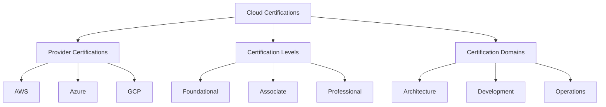
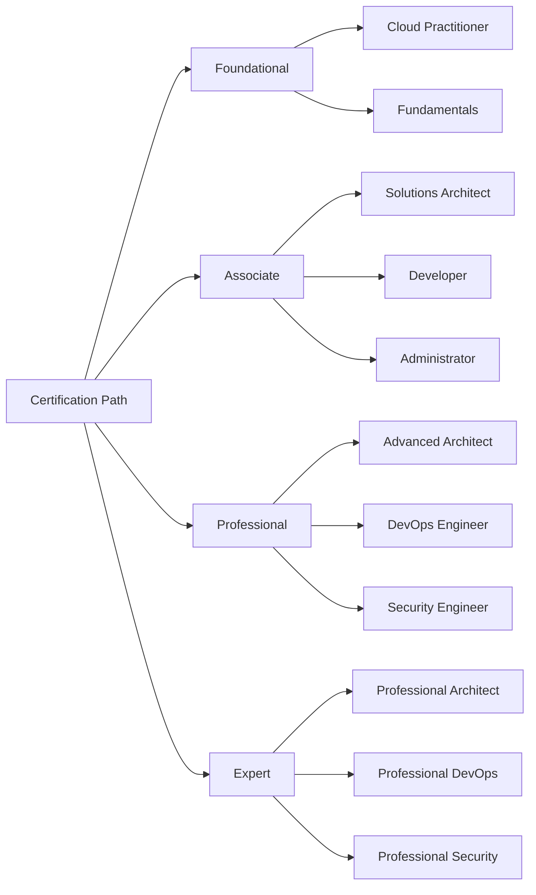

# Lesson 6.9: Cloud Certifications

## Navigation
- [← Back to Module Overview](./README.md)
- [Previous Lesson ←](./6.8-kubernetes-orchestration.md)
- [Next Lesson →](./6.10-devops-integration.md)

## Learning Objectives
- Understand cloud certification paths
- Master certification preparation
- Learn about exam strategies
- Practice certification planning

## Key Concepts

### Certification Framework
- Cloud Provider Certifications
  - AWS Certifications
  - Azure Certifications
  - GCP Certifications
  - Multi-cloud Certifications
- Certification Levels
  - Foundational
  - Associate
  - Professional
  - Specialty
  - Expert
- Certification Domains
  - Architecture
  - Development
  - Operations
  - Security
  - Data

### Certification Paths
- AWS Certification Path
  - Solutions Architect
  - Developer
  - SysOps Administrator
  - DevOps Engineer
  - Security
- Azure Certification Path
  - Solutions Architect
  - Developer
  - Administrator
  - DevOps Engineer
  - Security
- GCP Certification Path
  - Cloud Architect
  - Developer
  - Administrator
  - DevOps Engineer
  - Security

## Architecture Diagrams

### Certification Framework Architecture


### Certification Path Architecture


## Configuration Examples

### Certification Study Plan
```yaml
certification:
  name: AWS Solutions Architect
  level: Associate
  duration: 3_months
  study_plan:
    week_1_4:
      - fundamentals
      - architecture_basics
      - core_services
    week_5_8:
      - advanced_architecture
      - security
      - networking
    week_9_12:
      - practice_exams
      - review
      - exam_preparation
  resources:
    official_docs:
      - aws_documentation
      - whitepapers
      - best_practices
    practice:
      - sample_questions
      - hands_on_labs
      - mock_exams
```

### Exam Preparation Strategy
```yaml
preparation:
  methodology:
    - daily_study
    - hands_on_practice
    - review_sessions
    - mock_exams
  schedule:
    morning:
      - theory_review
      - documentation_study
    afternoon:
      - hands_on_practice
      - lab_exercises
    evening:
      - practice_questions
      - topic_review
  assessment:
    weekly:
      - progress_check
      - topic_mastery
    monthly:
      - full_mock_exam
      - performance_analysis
```

## Best Practices

### Certification Preparation
1. **Study Planning**
   - Create study schedule
   - Set clear goals
   - Track progress
   - Regular reviews

2. **Hands-on Practice**
   - Lab exercises
   - Real projects
   - Service exploration
   - Problem solving

3. **Exam Strategy**
   - Time management
   - Question analysis
   - Answer elimination
   - Review process

4. **Resource Management**
   - Official documentation
   - Practice tests
   - Study groups
   - Online courses

## Real-World Case Studies

### Case Study 1: Career Transition
- **Challenge**: Transition to cloud architecture
- **Solution**:
  - Certification path planning
  - Structured study approach
  - Hands-on practice
  - Exam preparation
- **Results**:
  - Multiple certifications
  - Better job prospects
  - Increased knowledge
  - Career growth

### Case Study 2: Team Certification
- **Challenge**: Certify entire team
- **Solution**:
  - Group study program
  - Shared resources
  - Regular sessions
  - Peer support
- **Results**:
  - Team certification
  - Better collaboration
  - Knowledge sharing
  - Improved skills

## Common Pitfalls
- Poor study planning
- Insufficient practice
- Exam anxiety
- Resource overload
- Time management issues

## Additional Resources
- Certification Guides
- Study Materials
- Practice Tests
- Online Courses

## Next Steps
- Choose certification path
- Create study plan
- Start preparation
- Schedule exam 