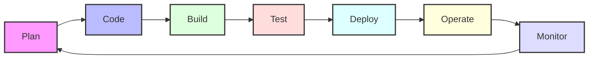

# Lesson 6.10: DevOps Integration

## Navigation
- [← Back to Lesson Plan](../6.10-devops-integration.md)
- [← Back to Module Overview](../README.md)

## Overview
Welcome to the world of DevOps Integration! Think of DevOps as the art of orchestrating development and operations in perfect harmony. In this lesson, we'll explore how DevOps practices transform the way we build, deploy, and maintain software. Whether you're a developer, operator, or somewhere in between, understanding DevOps integration is crucial in modern software development.

## Learning Objectives
After completing this lesson, you'll be able to:
- Implement comprehensive DevOps workflows
- Design and manage CI/CD pipelines
- Automate infrastructure deployment
- Integrate security into DevOps (DevSecOps)
- Monitor and optimize DevOps processes
- Create efficient feedback loops

## Key Topics

### 1. Understanding DevOps Integration

Let's visualize the DevOps lifecycle:



### 2. Implementing CI/CD Pipelines

Here's a practical implementation of a modern CI/CD pipeline:

```python
from typing import Dict, List, Optional
import logging
import asyncio

class CICDPipeline:
    """Implements a comprehensive CI/CD pipeline"""
    def __init__(self, config: Dict[str, Any]):
        self.config = config
        self.logger = logging.getLogger(__name__)
        self._initialize_pipeline()
        
    def _initialize_pipeline(self) -> None:
        """Initialize pipeline components"""
        try:
            # Set up source control integration
            self.source_control = self._setup_source_control()
            
            # Initialize build system
            self.build_system = self._setup_build_system()
            
            # Configure testing framework
            self.test_framework = self._setup_testing()
            
            # Set up deployment system
            self.deployment = self._setup_deployment()
            
        except Exception as e:
            self.logger.error(f"Pipeline initialization failed: {str(e)}")
            raise
            
    async def execute_pipeline(self, commit_id: str) -> None:
        """Execute the complete pipeline"""
        try:
            # Fetch code
            await self._fetch_code(commit_id)
            
            # Build application
            build_result = await self._build_application()
            
            # Run tests
            test_result = await self._run_tests()
            
            # Security scan
            security_result = await self._security_scan()
            
            # Deploy if all checks pass
            if all([build_result, test_result, security_result]):
                await self._deploy_application()
                
        except Exception as e:
            self.logger.error(f"Pipeline execution failed: {str(e)}")
            await self._notify_failure(str(e))
            raise
```

### 3. Infrastructure as Code (IaC)

Let's look at a practical IaC implementation:

```python
class InfrastructureManager:
    """Manages infrastructure through code"""
    def __init__(self, provider: str):
        self.provider = provider
        self.logger = logging.getLogger(__name__)
        
    async def deploy_infrastructure(self, config: Dict[str, Any]) -> None:
        """Deploy infrastructure based on configuration"""
        try:
            # Validate configuration
            self._validate_config(config)
            
            # Create network infrastructure
            network = await self._create_network(config['network'])
            
            # Deploy compute resources
            compute = await self._deploy_compute(config['compute'])
            
            # Configure storage
            storage = await self._setup_storage(config['storage'])
            
            # Setup security
            await self._configure_security(config['security'])
            
        except Exception as e:
            self.logger.error(f"Infrastructure deployment failed: {str(e)}")
            raise
```

### 4. Monitoring and Observability

Here's how to implement comprehensive monitoring:

```python
class DevOpsMonitoring:
    """Implements DevOps monitoring and observability"""
    def __init__(self, config: Dict[str, Any]):
        self.config = config
        self.logger = logging.getLogger(__name__)
        
    async def setup_monitoring(self) -> None:
        """Set up monitoring infrastructure"""
        try:
            # Initialize metrics collection
            self.metrics = await self._setup_metrics()
            
            # Configure logging
            self.logging = await self._setup_logging()
            
            # Set up tracing
            self.tracing = await self._setup_tracing()
            
            # Configure alerts
            self.alerts = await self._setup_alerts()
            
        except Exception as e:
            self.logger.error(f"Monitoring setup failed: {str(e)}")
            raise
            
    async def monitor_pipeline(self, pipeline_id: str) -> None:
        """Monitor pipeline execution"""
        metrics = {
            'build_time': 0,
            'test_coverage': 0,
            'deployment_time': 0,
            'error_count': 0
        }
        
        try:
            # Collect pipeline metrics
            metrics['build_time'] = await self._measure_build_time()
            metrics['test_coverage'] = await self._calculate_test_coverage()
            metrics['deployment_time'] = await self._measure_deployment_time()
            
            # Store metrics
            await self._store_metrics(pipeline_id, metrics)
            
            # Check thresholds and alert if necessary
            await self._check_thresholds(metrics)
            
        except Exception as e:
            self.logger.error(f"Pipeline monitoring failed: {str(e)}")
            raise
```

## Best Practices: Your DevOps Checklist

### 1. Version Control
✅ Use feature branches
✅ Implement code review
✅ Maintain clean history
✅ Automate merges

### 2. CI/CD Pipeline
🔄 Automate builds
🔄 Run comprehensive tests
🔄 Implement security scans
🔄 Automate deployments

### 3. Infrastructure
🏗️ Use Infrastructure as Code
🏗️ Implement immutable infrastructure
🏗️ Version infrastructure code
🏗️ Automate provisioning

### 4. Monitoring
📊 Collect relevant metrics
📊 Implement logging
📊 Set up alerting
📊 Monitor user experience

## Common Challenges and Solutions

### Challenge 1: Pipeline Performance
**Problem**: Slow CI/CD pipeline
**Solution**: Optimize build and test processes
```yaml
pipeline_optimization:
  parallel_execution:
    - unit_tests
    - security_scans
    - dependency_checks
  caching:
    - build_artifacts
    - test_results
    - dependencies
```

### Challenge 2: Infrastructure Drift
**Problem**: Manual infrastructure changes
**Solution**: Implement GitOps practices
```yaml
gitops_implementation:
  infrastructure:
    - version_control
    - automated_deployment
    - drift_detection
  processes:
    - pull_requests
    - automated_testing
    - approval_workflows
```

## Hands-on Practice

### Exercise 1: Setting Up a CI/CD Pipeline
1. Configure source control
2. Set up automated builds
3. Implement automated tests
4. Configure deployment

💡 **Pro Tip**: Start with a simple pipeline and gradually add complexity.

### Exercise 2: Infrastructure as Code
1. Create infrastructure templates
2. Implement version control
3. Set up automated deployment
4. Configure monitoring

## Review Questions

1. How would you design a CI/CD pipeline for a microservices architecture?
2. What strategies would you use to implement Infrastructure as Code?
3. How do you ensure security in a DevOps pipeline?
4. What metrics are important in DevOps monitoring?

## Additional Resources

📚 [DevOps Best Practices](https://www.atlassian.com/devops)
🔧 [Infrastructure as Code Guide](https://www.terraform.io/docs)
📊 [Monitoring Patterns](https://prometheus.io/docs/practices/naming/)
🔐 [DevSecOps Guide](https://www.devsecops.org/)

## Next Steps
1. Set up your first CI/CD pipeline
2. Implement Infrastructure as Code
3. Configure comprehensive monitoring
4. Practice DevOps workflows

Remember: DevOps is about culture as much as it is about tools. Focus on collaboration, automation, and continuous improvement! 🚀 