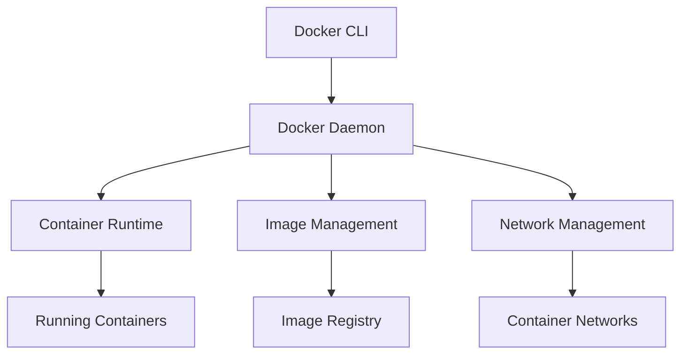

# Lesson 6.7: Docker Fundamentals

## Navigation
- [← Back to Lesson Plan](../6.7-docker-fundamentals.md)
- [← Back to Module Overview](../README.md)

## Table of Contents
1. [Introduction to Docker](#introduction-to-docker)
2. [Understanding Docker Architecture](#understanding-docker-architecture)
3. [Working with Docker Containers](#working-with-docker-containers)
4. [Managing Docker Images](#managing-docker-images)
5. [Docker Networking](#docker-networking)
6. [Docker Compose and Multi-Container Apps](#docker-compose-and-multi-container-apps)
7. [Security Best Practices](#security-best-practices)
8. [Hands-on Practice](#hands-on-practice)

## Introduction to Docker

### What is Docker?
Docker is a platform that enables developers to package applications into containers - standardized, executable components that combine application source code with all the dependencies needed to run that code in any environment.

Think of a container like a shipping container for your code. Just as shipping containers standardize how goods are transported worldwide, Docker containers standardize how we package and run software.

### Why Do We Need Docker?
Imagine you're developing an application on your laptop. It works perfectly, but when your colleague tries to run it on their machine, it fails. Sound familiar? This is the "it works on my machine" problem that Docker solves.

Docker ensures that:
- Your application runs the same way everywhere
- Dependencies are packaged with your application
- Applications are isolated from each other
- Deployment is consistent and repeatable

## Understanding Docker Architecture

### Core Components
Let's break down Docker's architecture into digestible pieces:

1. **Docker Engine**: The heart of Docker
   - Docker daemon (server)
   - REST API
   - Command-line interface (CLI)

2. **Docker Objects**:
   - Images: Your application blueprint
   - Containers: Running instances of images
   - Networks: How containers communicate
   - Volumes: Where containers store data

Here's a visual representation of how these components work together:



## Working with Docker Containers

### Creating Your First Container
Let's start with a simple example. Here's how we can create and manage a container programmatically:

```python
# Example: Creating a basic container
async def create_simple_container():
    """
    Creates a simple Python web application container
    """
    manager = DockerContainerManager(config={})
    
    # Define container configuration
    container_config = {
        "name": "my-first-app",
        "environment": {
            "PYTHON_ENV": "development"
        },
        "ports": {
            "8000/tcp": 8000  # Maps container port 8000 to host port 8000
        }
    }
    
    # Create the container
    container = await manager.create_container(
        image="python:3.9-slim",
        container_config=container_config
    )
    
    return container

# Let's break down what this does:
# 1. We specify a name for our container
# 2. We set an environment variable
# 3. We map container ports to host ports
# 4. We use the official Python image as our base
```

### Container Lifecycle
Every container goes through several states:
1. Created → When you create a new container
2. Running → When the container is executing
3. Paused → When you temporarily stop the container
4. Stopped → When the container exits
5. Deleted → When you remove the container

## Managing Docker Images

### Building Efficient Images
Creating efficient Docker images is crucial for performance. Here's a production-ready example:

```dockerfile
# Start with a minimal base image
FROM python:3.9-slim-buster as builder

# Set working directory
WORKDIR /app

# BEST PRACTICE: Copy requirements first
# This leverages Docker's layer caching
COPY requirements.txt .

# Install dependencies
RUN pip install --no-cache-dir -r requirements.txt

# Copy application code
COPY . .

# SECURITY BEST PRACTICE: Run as non-root user
RUN useradd -m appuser && \
    chown -R appuser:appuser /app

USER appuser

# Configure environment
ENV PYTHONPATH=/app

CMD ["python", "app.py"]
```

Let's understand why each line matters:
- `FROM python:3.9-slim-buster`: Uses a minimal Python image
- `COPY requirements.txt` first: Optimizes build caching
- `RUN useradd -m appuser`: Enhances security
- `ENV PYTHONPATH=/app`: Sets up Python environment

## Docker Networking

### Understanding Container Communication
Containers need to communicate with each other and the outside world. Here's how we set up networking:

```python
# Example: Creating a custom network
async def setup_application_network():
    """
    Creates an isolated network for your application
    """
    network_config = {
        "name": "my-app-network",
        "driver": "bridge",
        "subnet": "172.20.0.0/16",
        "gateway": "172.20.0.1"
    }
    
    network_manager = DockerNetworkManager(config={})
    network = await network_manager.create_network(network_config)
    
    return network

# This creates:
# - An isolated network for your containers
# - A specific subnet for IP addressing
# - A gateway for external communication
```

## Docker Compose and Multi-Container Apps

### Real-World Application Example
Most applications require multiple services. Here's a practical example of a web application with a database:

```yaml
# docker-compose.yml
version: '3.8'

services:
  # Web Application Service
  web:
    build: 
      context: ./web
      dockerfile: Dockerfile
    ports:
      - "8000:8000"
    environment:
      - DATABASE_URL=postgresql://user:password@db:5432/dbname
    depends_on:
      - db
    networks:
      - app-network
    # Health monitoring
    healthcheck:
      test: ["CMD", "curl", "-f", "http://localhost:8000/health"]
      interval: 30s
      timeout: 10s
      retries: 3

  # Database Service
  db:
    image: postgres:13-alpine
    environment:
      - POSTGRES_USER=user
      - POSTGRES_PASSWORD=password
      - POSTGRES_DB=dbname
    volumes:
      - postgres_data:/var/lib/postgresql/data
    networks:
      - app-network
    healthcheck:
      test: ["CMD-SHELL", "pg_isready -U user -d dbname"]
      interval: 10s
      timeout: 5s
      retries: 5

# Persistent storage
volumes:
  postgres_data:

# Application network
networks:
  app-network:
    driver: bridge
```

Let's break this down:
1. We define two services: `web` and `db`
2. They communicate over a shared network
3. The database uses persistent storage
4. Both services have health checks
5. Environment variables configure the services

## Security Best Practices

### Securing Your Containers
Security should never be an afterthought. Here are the key areas to focus on:

1. **Image Security**
   - Use official base images
   - Regularly scan for vulnerabilities
   - Keep images up to date
   - Remove unnecessary packages

2. **Runtime Security**
   ```python
   # Example: Securing a container
   security_config = {
       "cpu_quota": 50000,  # Limit CPU usage
       "memory_limit": "512m",  # Limit memory usage
       "apparmor_profile": "docker-default",  # Apply AppArmor profile
   }
   
   # Apply security configurations
   await security_manager.secure_container(
       container_id="my-container",
       security_config=security_config
   )
   ```

## Hands-on Practice

### Exercise 1: Your First Container
Create a simple web application container:
```python
# Try creating a container that:
# 1. Uses Python 3.9
# 2. Exposes port 8000
# 3. Sets environment variables
# 4. Implements health checks
```

### Exercise 2: Multi-Container Application
Build a web application with a database:
1. Create a `docker-compose.yml`
2. Define services for web and database
3. Set up networking between services
4. Implement persistent storage
5. Add health checks

## Review Questions

1. What problem does Docker solve in software development?
2. How do Docker images and containers differ?
3. Why is container security important?
4. How does Docker Compose simplify multi-container applications?

## Additional Resources

- [Docker Official Documentation](https://docs.docker.com/)
- [Container Security Best Practices](https://docs.docker.com/develop/security-best-practices/)
- [Docker Compose Documentation](https://docs.docker.com/compose/)

## Next Steps
- Complete the hands-on exercises
- Build a multi-container application
- Explore container orchestration with Kubernetes
- Study advanced Docker security features 