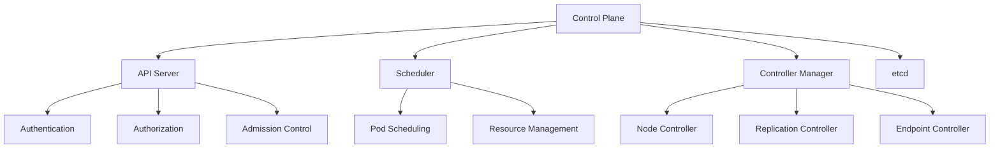

# Lesson 6.8: Kubernetes Orchestration

## Navigation
- [← Back to Lesson Plan](../6.8-kubernetes-orchestration.md)
- [← Back to Module Overview](../README.md)

## Overview
Welcome to our deep dive into Kubernetes orchestration! In this lesson, we'll explore how Kubernetes has revolutionized container orchestration and why it has become the industry standard. Think of Kubernetes as a highly efficient orchestra conductor, coordinating countless containers across your infrastructure with precision and reliability.

## Learning Objectives
After completing this lesson, you'll be able to:
- Understand and implement Kubernetes architecture components
- Design and manage Kubernetes clusters effectively
- Implement resource management strategies
- Configure networking and storage solutions
- Apply security best practices
- Troubleshoot common issues

## Key Topics

### 1. Understanding Kubernetes Architecture

Let's start by breaking down Kubernetes into digestible pieces. Imagine building a city - you need a city hall (control plane), workers (nodes), and various systems to keep everything running smoothly.

#### The Control Plane: The Brain of Your Cluster
Think of the control plane as the command center of your Kubernetes city. Here's how it's organized:



Let's explore each component:

1. **API Server: The City Hall**
   - Acts as the central management point
   - Processes all REST requests
   - Validates and configures data
   - Serves as the gateway for all administrative tasks

   Think of it as the city hall where all official decisions are made and recorded.

2. **Scheduler: The Urban Planner**
   - Decides where to place new containers (pods)
   - Analyzes resource requirements
   - Makes intelligent placement decisions
   - Ensures efficient resource utilization

   Just like an urban planner decides where to place new buildings in a city.

3. **Controller Manager: The City Services Department**
   - Maintains the desired state
   - Handles node failures
   - Manages replication
   - Coordinates various controllers

   Similar to how city services ensure everything runs according to plan.

4. **etcd: The City's Record Office**
   - Stores all cluster data
   - Maintains configuration information
   - Provides reliable data storage
   - Enables backup and recovery

   Like a secure vault where all important city records are kept.

### 2. Worker Nodes: Where the Work Happens

Let's look at how worker nodes operate. Here's a practical implementation:

```python
# Example: Node Management Implementation
class KubernetesNode:
    """Manages Kubernetes node operations"""
    def __init__(self, config: Dict[str, Any]):
        self.config = config
        self.logger = logging.getLogger(__name__)
        
    async def initialize_node(self) -> None:
        """Initialize node components"""
        try:
            # Initialize kubelet
            self.kubelet = await self._setup_kubelet()
            
            # Initialize container runtime
            self.container_runtime = await self._setup_container_runtime()
            
            # Initialize kube-proxy
            self.kube_proxy = await self._setup_kube_proxy()
            
            # Register node with cluster
            await self._register_with_cluster()
            
        except Exception as e:
            self.logger.error(f"Node initialization failed: {str(e)}")
            raise
```

💡 **Key Insight**: Each worker node is like a factory in your city, running containers and reporting back to the control plane.

### 3. Practical Resource Management

Now, let's see how to deploy applications in our Kubernetes environment. Here's a real-world example:

```yaml
apiVersion: apps/v1
kind: Deployment
metadata:
  name: web-application
  namespace: production
  labels:
    app: web
    environment: production
spec:
  replicas: 3  # Running 3 copies for high availability
  strategy:
    type: RollingUpdate  # Update pods one by one
    rollingUpdate:
      maxSurge: 1        # Maximum extra pods during update
      maxUnavailable: 0  # Never have unavailable pods
  template:
    spec:
      containers:
      - name: web
        image: nginx:1.21
        resources:
          requests:
            memory: "128Mi"  # Minimum memory needed
            cpu: "100m"      # 0.1 CPU cores
          limits:
            memory: "256Mi"  # Maximum memory allowed
            cpu: "200m"      # 0.2 CPU cores
```

📝 **Important Note**: Think of resource limits like building codes in a city - they ensure no single application can consume too many resources.

### 4. Networking Made Simple

Kubernetes networking can be complex, but let's break it down with a practical example:

```python
class KubernetesNetworking:
    """Implements Kubernetes networking configuration"""
    async def configure_network_policy(self, namespace: str) -> None:
        """Configure network policies for namespace"""
        try:
            policy = {
                "apiVersion": "networking.k8s.io/v1",
                "kind": "NetworkPolicy",
                "metadata": {
                    "name": "default-deny",
                    "namespace": namespace
                },
                "spec": {
                    "podSelector": {},
                    "policyTypes": ["Ingress", "Egress"]
                }
            }
            await self._apply_network_policy(policy)
        except Exception as e:
            self.logger.error(f"Network policy configuration failed: {str(e)}")
            raise
```

🔍 **Think of It This Way**: Network policies are like traffic rules in your city, controlling how different parts of your application communicate.

## Best Practices: Your Kubernetes Checklist

### 1. Cluster Management
✅ Implement resource quotas
✅ Use namespaces for isolation
✅ Configure auto-scaling
✅ Regular monitoring

### 2. Security First
🔒 Enable RBAC (Role-Based Access Control)
🔒 Implement network policies
🔒 Use pod security policies
🔒 Regular security audits

### 3. Ensuring High Availability
⚡ Multiple control plane nodes
⚡ Distributed etcd clusters
⚡ Node anti-affinity rules
⚡ Regular backups

## Common Challenges and Solutions

### Challenge 1: Resource Management
**Problem**: Applications running out of resources
**Solution**: Implement proper resource limits
```yaml
resources:
  requests:
    memory: "128Mi"
    cpu: "100m"
  limits:
    memory: "256Mi"
    cpu: "200m"
```

### Challenge 2: Networking Issues
**Problem**: Pods can't communicate
**Solution**: Configure network policies
```yaml
apiVersion: networking.k8s.io/v1
kind: NetworkPolicy
metadata:
  name: allow-internal
spec:
  podSelector:
    matchLabels:
      app: internal
```

## Hands-on Practice

### Exercise 1: Setting Up Your First Cluster
1. Install required tools
2. Initialize the control plane
3. Join worker nodes
4. Verify cluster health

💡 **Pro Tip**: Start small and gradually add complexity as you become comfortable with the basics.

### Exercise 2: Deploying Your First Application
1. Create a deployment manifest
2. Apply the configuration
3. Verify pod status
4. Test scaling capabilities

## Review Questions

1. How do the control plane components work together to manage a cluster?
2. What role do worker nodes play in a Kubernetes cluster?
3. How would you implement high availability in a production environment?
4. What security measures are essential for a production cluster?

## Additional Resources

📚 [Kubernetes Official Documentation](https://kubernetes.io/docs/)
🔧 [Best Practices Guide](https://kubernetes.io/docs/concepts/configuration/overview/)
🔐 [Security Guidelines](https://kubernetes.io/docs/concepts/security/)
🌐 [Networking Deep Dive](https://kubernetes.io/docs/concepts/cluster-administration/networking/)

## Next Steps
1. Complete the hands-on exercises
2. Explore advanced features
3. Practice cluster management
4. Study service mesh implementations

Remember: Kubernetes is powerful but complex. Take it step by step, and don't hesitate to experiment in a safe environment! 