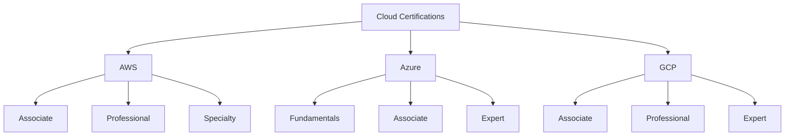

# Lesson 6.9: Cloud Certifications

## Navigation
- [← Back to Lesson Plan](../6.9-cloud-certifications.md)
- [← Back to Module Overview](../README.md)

## Overview
Welcome to the world of cloud certifications! Think of cloud certifications as your passport to the ever-expanding universe of cloud computing. In this lesson, we'll navigate the certification landscape and create your roadmap to becoming a certified cloud professional. Whether you're just starting or advancing your career, there's a certification path perfect for you.

## Learning Objectives
After completing this lesson, you'll be able to:
- Navigate different cloud certification paths
- Create effective certification study plans
- Implement exam preparation strategies
- Choose the right certifications for your career goals
- Understand certification requirements and prerequisites
- Develop a long-term certification strategy

## Key Topics

### 1. Understanding the Certification Landscape

Let's map out the cloud certification universe:



#### Major Cloud Providers and Their Certifications

1. **AWS Certification Path** 🌟
   - Cloud Practitioner (Entry Level)
   - Solutions Architect Associate
   - Developer Associate
   - SysOps Administrator Associate
   - DevOps Engineer Professional
   - Solutions Architect Professional

2. **Azure Certification Path** 💫
   - Azure Fundamentals (AZ-900)
   - Azure Administrator (AZ-104)
   - Azure Developer (AZ-204)
   - Azure Solutions Architect (AZ-305)
   - Azure DevOps Engineer (AZ-400)

3. **Google Cloud Path** 🚀
   - Cloud Digital Leader
   - Associate Cloud Engineer
   - Professional Cloud Architect
   - Professional Data Engineer
   - Professional Cloud DevOps Engineer

### 2. Creating Your Certification Strategy

Here's a strategic approach to certification planning:

```yaml
certification_strategy:
  assessment:
    current_skills:
      - technical_background
      - cloud_experience
      - career_goals
    
  planning:
    short_term:
      - foundational_certification
      - hands_on_practice
      - basic_concepts
    
    medium_term:
      - associate_level_certs
      - specialization_focus
      - practical_projects
    
    long_term:
      - professional_certs
      - multi_cloud_expertise
      - continuous_learning

  study_approach:
    daily_routine:
      morning:
        - theory_review: 1h
        - practice_questions: 30m
      
      evening:
        - hands_on_labs: 1h
        - topic_summary: 30m
    
    weekly_goals:
      - complete_one_module
      - practice_lab_exercises
      - mock_exam_attempt
      - review_weak_areas
```

### 3. Exam Preparation Best Practices

📚 **Study Materials Organization**:
```python
class CertificationPrep:
    """Manages certification preparation resources and progress"""
    def __init__(self, certification_path: str):
        self.path = certification_path
        self.progress = {}
        self.resources = self._initialize_resources()
        
    def _initialize_resources(self) -> Dict[str, List[str]]:
        """Set up study resources by topic"""
        return {
            "official_docs": [],
            "practice_tests": [],
            "video_courses": [],
            "hands_on_labs": [],
            "study_guides": []
        }
        
    def track_progress(self, topic: str, status: float) -> None:
        """Track study progress by topic"""
        self.progress[topic] = status
        
    def generate_study_plan(self) -> Dict[str, Any]:
        """Create personalized study plan"""
        return {
            "daily_goals": self._set_daily_goals(),
            "weekly_milestones": self._set_weekly_milestones(),
            "practice_schedule": self._create_practice_schedule()
        }
```

## Best Practices: Your Certification Success Checklist

### 1. Study Preparation
✅ Create a dedicated study schedule
✅ Use official documentation
✅ Take practice exams
✅ Join study groups

### 2. Hands-on Experience
🔧 Set up personal projects
🔧 Complete lab exercises
🔧 Build practical solutions
🔧 Document your learning

### 3. Exam Strategy
📋 Review exam objectives
📋 Practice time management
📋 Learn question patterns
📋 Master key concepts

## Common Challenges and Solutions

### Challenge 1: Time Management
**Problem**: Balancing study with work
**Solution**: Create a realistic study schedule
```yaml
weekly_schedule:
  weekdays:
    morning:
      - theory_study: 1h
    evening:
      - practical_labs: 1h
  weekends:
    - practice_exams
    - topic_review
    - hands_on_projects
```

### Challenge 2: Practical Experience
**Problem**: Limited hands-on practice
**Solution**: Set up a home lab environment
```yaml
home_lab:
  infrastructure:
    - virtual_machines
    - cloud_accounts
    - development_tools
  projects:
    - web_application
    - database_deployment
    - network_setup
```

## Hands-on Practice

### Exercise 1: Certification Planning
1. Assess your current skills
2. Choose a certification path
3. Create a study schedule
4. Set up practice environment

💡 **Pro Tip**: Start with foundational certifications before moving to advanced ones.

### Exercise 2: Exam Preparation
1. Review exam objectives
2. Take practice tests
3. Build hands-on projects
4. Join study groups

## Review Questions

1. Which certification path best aligns with your career goals?
2. How would you structure your study plan for maximum efficiency?
3. What strategies can you use to gain practical experience?
4. How do you prepare for hands-on exam questions?

## Additional Resources

📚 [AWS Certification Portal](https://aws.amazon.com/certification/)
📚 [Microsoft Learn](https://learn.microsoft.com/certifications/)
📚 [Google Cloud Training](https://cloud.google.com/certification)
📝 [Cloud Practice Tests](https://www.whizlabs.com/)

## Next Steps
1. Choose your certification path
2. Create your study plan
3. Set up your practice environment
4. Start your certification journey

Remember: Certification is a journey, not a destination. Take it one step at a time, and focus on understanding rather than just memorizing! 🎯 