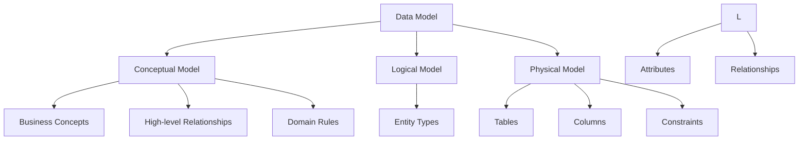
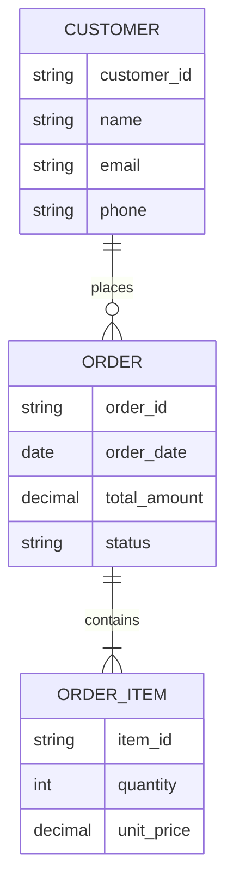

# Lesson 7.1: Introduction to Data Modeling

## Navigation
- [← Back to Module Overview](./README.md)
- [Next Lesson →](./7.2-conceptual-data-modeling.md)

## Learning Objectives
- Understand data modeling concepts and principles
- Learn about different modeling approaches
- Explore modeling best practices
- Practice basic modeling techniques

## Key Concepts

### Data Modeling Fundamentals
- Data Model Types
  - Conceptual Models
  - Logical Models
  - Physical Models
- Modeling Approaches
  - Entity-Relationship (ER)
  - Object-Oriented
  - Dimensional
  - Data Vault
- Modeling Principles
  - Normalization
  - Abstraction
  - Consistency
  - Scalability

### Data Model Components
- Entities
  - Entity Types
  - Entity Attributes
  - Entity Relationships
- Attributes
  - Data Types
  - Constraints
  - Default Values
- Relationships
  - Cardinality
  - Optionality
  - Inheritance
  - Aggregation

## Architecture Diagrams

### Data Model Hierarchy


### Entity-Relationship Model


## Configuration Examples

### Entity Definition
```yaml
entity:
  name: Customer
  description: "Customer information"
  attributes:
    - name: customer_id
      type: string
      constraints:
        - primary_key
        - unique
        - not_null
    - name: name
      type: string
      constraints:
        - not_null
    - name: email
      type: string
      constraints:
        - unique
        - not_null
  relationships:
    - type: one_to_many
      target: Order
      description: "Customer places orders"
```

### Relationship Definition
```yaml
relationship:
  name: places_order
  type: one_to_many
  source: Customer
  target: Order
  attributes:
    - name: order_date
      type: timestamp
      constraints:
        - not_null
    - name: status
      type: enum
      values:
        - pending
        - processing
        - completed
        - cancelled
  constraints:
    - foreign_key
    - cascade_delete
```

## Best Practices

### Data Modeling Guidelines
1. **Model Design**
   - Clear entity definitions
   - Consistent naming
   - Proper relationships
   - Appropriate constraints

2. **Normalization**
   - First normal form
   - Second normal form
   - Third normal form
   - Denormalization when needed

3. **Documentation**
   - Entity descriptions
   - Relationship explanations
   - Constraint documentation
   - Business rules

4. **Validation**
   - Data integrity
   - Business rules
   - Performance considerations
   - Scalability assessment

## Real-World Case Studies

### Case Study 1: E-commerce Data Model
- **Challenge**: Design scalable e-commerce data model
- **Solution**:
  - Normalized product catalog
  - Flexible order management
  - Customer relationship model
  - Inventory tracking
- **Results**:
  - Better data organization
  - Improved performance
  - Easier maintenance
  - Scalable structure

### Case Study 2: Healthcare Data Model
- **Challenge**: Design compliant healthcare data model
- **Solution**:
  - HIPAA-compliant structure
  - Patient relationship model
  - Clinical data organization
  - Audit trail implementation
- **Results**:
  - Regulatory compliance
  - Better data security
  - Improved patient care
  - Efficient reporting

## Common Pitfalls
- Over-normalization
- Poor relationship design
- Inconsistent naming
- Missing constraints
- Inadequate documentation

## Additional Resources
- Data Modeling Tools
- Best Practices Guide
- Industry Standards
- Case Studies

## Next Steps
- Learn about advanced modeling
- Practice with real scenarios
- Explore modeling tools
- Understand normalization 