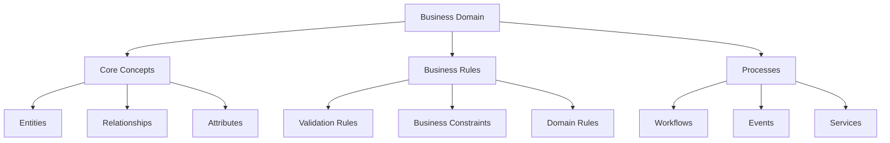
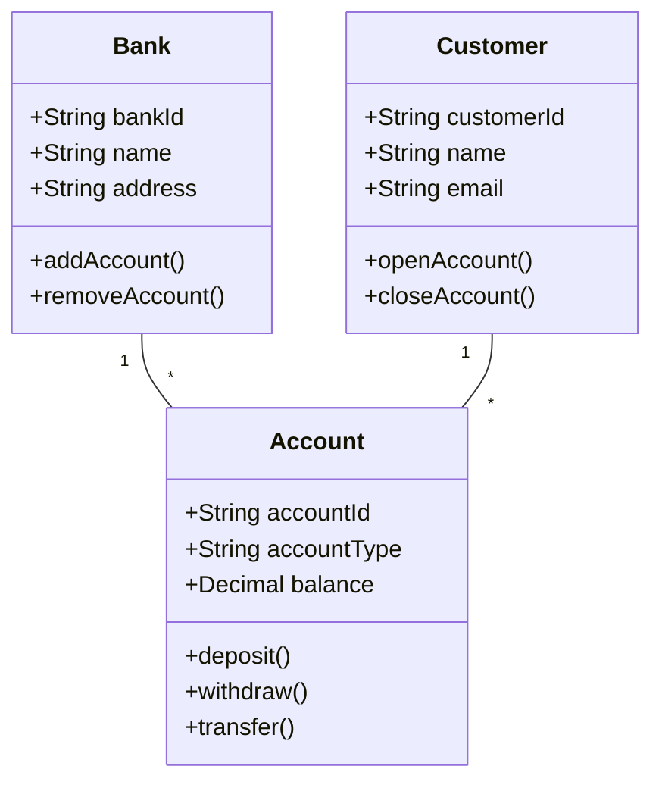

# Lesson 7.2: Conceptual Data Modeling

## Navigation
- [← Back to Module Overview](./README.md)
- [Previous Lesson ←](./7.1-introduction-to-data-modeling.md)
- [Next Lesson →](./7.3-logical-data-modeling.md)

## Learning Objectives
- Understand conceptual modeling principles
- Learn about entity-relationship modeling
- Master business requirements analysis
- Practice domain modeling techniques

## Key Concepts

### Conceptual Model Fundamentals
- Business Requirements
  - Stakeholder Analysis
  - Business Rules
  - Domain Knowledge
  - Use Cases
- Entity-Relationship Modeling
  - Entity Identification
  - Relationship Types
  - Cardinality Rules
  - Business Constraints
- Domain Modeling
  - Domain Concepts
  - Domain Rules
  - Domain Events
  - Domain Services

### Conceptual Model Components
- Business Entities
  - Core Entities
  - Supporting Entities
  - Lookup Entities
  - Reference Entities
- Business Relationships
  - Hierarchical
  - Associative
  - Aggregative
  - Compositional
- Business Rules
  - Validation Rules
  - Derivation Rules
  - Constraint Rules
  - Process Rules

## Architecture Diagrams

### Conceptual Model Structure


### Domain Model Example


## Configuration Examples

### Business Entity Definition
```yaml
business_entity:
  name: Bank
  description: "Financial institution"
  attributes:
    - name: bankId
      type: string
      description: "Unique identifier"
      business_rules:
        - "Must be unique"
        - "Format: BNK-XXXXX"
    - name: name
      type: string
      description: "Bank name"
      business_rules:
        - "Required"
        - "Max length: 100"
  relationships:
    - type: one_to_many
      target: Account
      description: "Bank holds accounts"
      business_rules:
        - "Bank must have at least one account"
        - "Account must belong to one bank"
```

### Business Rule Definition
```yaml
business_rule:
  name: account_balance_rule
  description: "Account balance cannot be negative"
  type: validation
  scope: Account
  condition: balance >= 0
  actions:
    - type: prevent
      message: "Account balance cannot be negative"
    - type: notify
      target: "account_holder"
      message: "Your account balance is low"
  exceptions:
    - type: overdraft
      condition: has_overdraft_protection
```

## Best Practices

### Conceptual Modeling Guidelines
1. **Business Analysis**
   - Clear requirements
   - Stakeholder input
   - Domain expertise
   - Use case validation

2. **Entity Design**
   - Clear boundaries
   - Proper abstraction
   - Business relevance
   - Future extensibility

3. **Relationship Design**
   - Clear semantics
   - Proper cardinality
   - Business rules
   - Integrity constraints

4. **Documentation**
   - Business context
   - Domain rules
   - Assumptions
   - Constraints

## Real-World Case Studies

### Case Study 1: Banking System Model
- **Challenge**: Design banking system conceptual model
- **Solution**:
  - Core banking entities
  - Transaction relationships
  - Business rules
  - Process flows
- **Results**:
  - Clear domain model
  - Well-defined rules
  - Scalable structure
  - Maintainable design

### Case Study 2: Healthcare System Model
- **Challenge**: Design healthcare system conceptual model
- **Solution**:
  - Patient care entities
  - Clinical relationships
  - Medical rules
  - Care processes
- **Results**:
  - Patient-centric model
  - Clinical accuracy
  - Regulatory compliance
  - Care quality

## Common Pitfalls
- Over-complex models
- Missing business rules
- Poor abstraction
- Incomplete requirements
- Insufficient validation

## Additional Resources
- Business Analysis Tools
- Domain Modeling Guide
- Industry Standards
- Case Studies

## Next Steps
- Learn about logical modeling
- Practice with real scenarios
- Explore modeling tools
- Understand business rules 