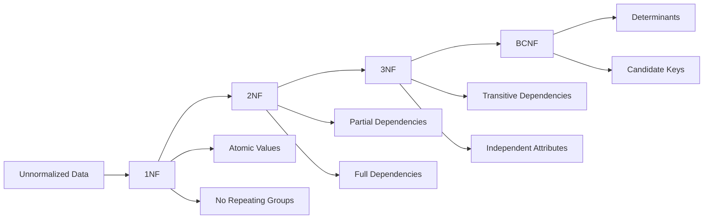
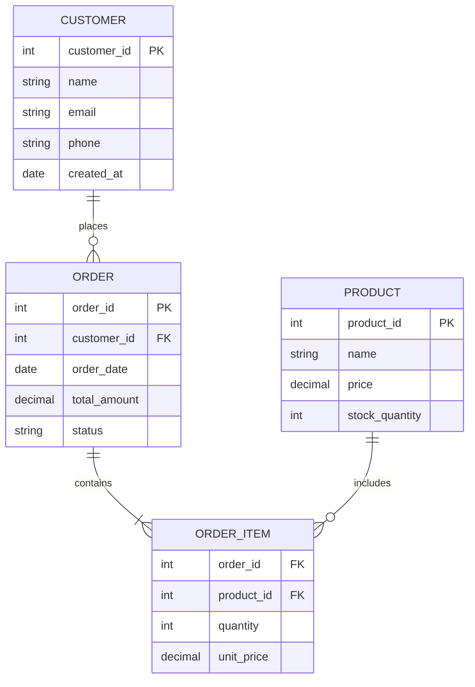

# Lesson 7.3: Logical Data Modeling

## Navigation
- [← Back to Module Overview](./README.md)
- [Previous Lesson ←](./7.2-conceptual-data-modeling.md)
- [Next Lesson →](./7.4-physical-data-modeling.md)

## Learning Objectives
- Understand logical modeling principles
- Master normalization techniques
- Learn about data relationships
- Practice logical model design

## Key Concepts

### Logical Model Fundamentals
- Normalization
  - First Normal Form (1NF)
  - Second Normal Form (2NF)
  - Third Normal Form (3NF)
  - Boyce-Codd Normal Form (BCNF)
- Data Relationships
  - One-to-One
  - One-to-Many
  - Many-to-Many
  - Recursive
- Data Integrity
  - Entity Integrity
  - Referential Integrity
  - Domain Integrity
  - Business Rules

### Logical Model Components
- Tables
  - Primary Keys
  - Foreign Keys
  - Composite Keys
  - Surrogate Keys
- Columns
  - Data Types
  - Constraints
  - Default Values
  - Computed Values
- Relationships
  - Cardinality
  - Optionality
  - Cascading Rules
  - Integrity Rules

## Architecture Diagrams

### Normalization Process


### Logical Model Structure


## Configuration Examples

### Table Definition
```yaml
table:
  name: Customer
  description: "Customer information"
  columns:
    - name: customer_id
      type: integer
      constraints:
        - primary_key
        - auto_increment
        - not_null
    - name: name
      type: varchar(100)
      constraints:
        - not_null
    - name: email
      type: varchar(255)
      constraints:
        - unique
        - not_null
    - name: phone
      type: varchar(20)
      constraints:
        - nullable
  indexes:
    - name: idx_email
      columns: [email]
      type: unique
```

### Relationship Definition
```yaml
relationship:
  name: customer_orders
  type: one_to_many
  source_table: Customer
  target_table: Order
  foreign_key:
    column: customer_id
    references: Customer.customer_id
  constraints:
    - on_delete: restrict
    - on_update: cascade
  indexes:
    - name: idx_customer_id
      columns: [customer_id]
```

## Best Practices

### Logical Modeling Guidelines
1. **Normalization**
   - Follow normal forms
   - Avoid redundancy
   - Maintain integrity
   - Consider performance

2. **Relationship Design**
   - Clear cardinality
   - Proper constraints
   - Indexing strategy
   - Performance impact

3. **Data Types**
   - Appropriate types
   - Size optimization
   - Precision handling
   - Future growth

4. **Constraints**
   - Primary keys
   - Foreign keys
   - Unique constraints
   - Check constraints

## Real-World Case Studies

### Case Study 1: Retail Database
- **Challenge**: Design normalized retail database
- **Solution**:
  - Product catalog tables
  - Order management
  - Customer data
  - Inventory tracking
- **Results**:
  - Efficient queries
  - Data integrity
  - Easy maintenance
  - Scalable design

### Case Study 2: HR System
- **Challenge**: Design HR system database
- **Solution**:
  - Employee data
  - Department structure
  - Position management
  - Salary tracking
- **Results**:
  - Accurate reporting
  - Data consistency
  - Easy updates
  - Compliance ready

## Common Pitfalls
- Over-normalization
- Poor indexing
- Missing constraints
- Inefficient types
- Complex relationships

## Additional Resources
- Database Design Tools
- Normalization Guide
- SQL Standards
- Best Practices

## Next Steps
- Learn about physical modeling
- Practice normalization
- Explore database tools
- Understand performance 