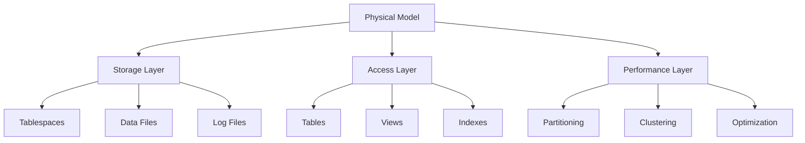
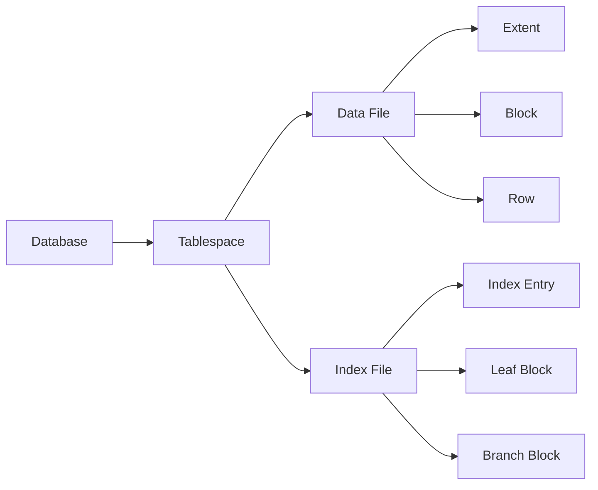

# Lesson 7.4: Physical Data Modeling

## Navigation
- [← Back to Module Overview](./README.md)
- [Previous Lesson ←](./7.3-logical-data-modeling.md)
- [Next Lesson →](./7.5-data-lineage.md)

## Learning Objectives
- Understand physical modeling principles
- Master database-specific modeling
- Learn about performance optimization
- Practice physical model design

## Key Concepts

### Physical Model Fundamentals
- Database-Specific Features
  - Data Types
  - Storage Options
  - Indexing Types
  - Partitioning
- Performance Optimization
  - Query Optimization
  - Storage Optimization
  - Index Optimization
  - Cache Management
- Storage Considerations
  - Data Volume
  - Growth Patterns
  - Access Patterns
  - Backup Requirements

### Physical Model Components
- Database Objects
  - Tables
  - Views
  - Indexes
  - Stored Procedures
- Storage Structures
  - Tablespaces
  - Data Files
  - Log Files
  - Temp Files
- Performance Features
  - Partitioning
  - Clustering
  - Materialized Views
  - Query Hints

## Architecture Diagrams

### Physical Model Structure


### Database Storage Architecture


## Configuration Examples

### Tablespace Configuration
```yaml
tablespace:
  name: user_data
  type: permanent
  storage:
    initial: 100M
    next: 50M
    maxsize: unlimited
    pctincrease: 0
  datafiles:
    - name: user_data_01.dbf
      size: 100M
      autoextend: true
      maxsize: 1G
    - name: user_data_02.dbf
      size: 100M
      autoextend: true
      maxsize: 1G
  segments:
    - type: table
      name: users
      storage:
        initial: 10M
        next: 5M
```

### Table Partitioning
```yaml
table:
  name: orders
  partitioning:
    type: range
    column: order_date
    partitions:
      - name: p_2023_q1
        values: less_than('2023-04-01')
      - name: p_2023_q2
        values: less_than('2023-07-01')
      - name: p_2023_q3
        values: less_than('2023-10-01')
      - name: p_2023_q4
        values: less_than('2024-01-01')
    storage:
      initial: 100M
      next: 50M
```

## Best Practices

### Physical Modeling Guidelines
1. **Storage Design**
   - Appropriate sizing
   - Growth planning
   - Backup strategy
   - Recovery options

2. **Performance Optimization**
   - Index strategy
   - Partition design
   - Query optimization
   - Cache management

3. **Database Features**
   - Feature selection
   - Configuration tuning
   - Resource allocation
   - Monitoring setup

4. **Maintenance**
   - Regular maintenance
   - Performance monitoring
   - Storage management
   - Backup verification

## Real-World Case Studies

### Case Study 1: High-Volume Database
- **Challenge**: Design high-volume transaction database
- **Solution**:
  - Partitioned tables
  - Optimized indexes
  - Efficient storage
  - Performance tuning
- **Results**:
  - Fast queries
  - Efficient storage
  - Easy maintenance
  - Scalable design

### Case Study 2: Data Warehouse
- **Challenge**: Design analytical database
- **Solution**:
  - Star schema
  - Materialized views
  - Bitmap indexes
  - Partition strategy
- **Results**:
  - Fast analytics
  - Efficient storage
  - Easy updates
  - Better reporting

## Common Pitfalls
- Poor storage planning
- Inefficient indexing
- Missing partitions
- Resource constraints
- Backup issues

## Additional Resources
- Database Administration Guide
- Performance Tuning Guide
- Storage Management Guide
- Best Practices

## Next Steps
- Learn about data lineage
- Practice performance tuning
- Explore database features
- Understand monitoring 