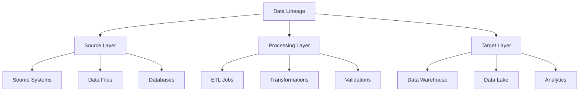
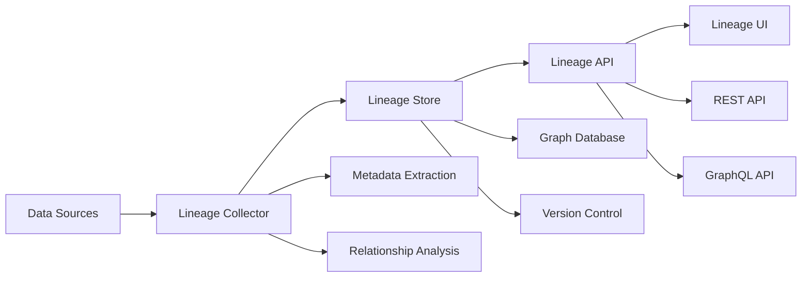

# Lesson 7.5: Data Lineage

## Navigation
- [← Back to Module Overview](./README.md)
- [Previous Lesson ←](./7.4-physical-data-modeling.md)
- [Next Lesson →](./7.6-metadata-management.md)

## Learning Objectives
- Understand data lineage concepts and importance
- Learn about lineage tracking tools and techniques
- Master Apache Atlas implementation
- Practice lineage documentation and visualization

## Key Concepts

### Data Lineage Fundamentals
- Lineage Concepts
  - Data Provenance
  - Impact Analysis
  - Root Cause Analysis
  - Compliance Tracking
- Lineage Types
  - Technical Lineage
  - Business Lineage
  - Operational Lineage
  - End-to-End Lineage
- Lineage Components
  - Source Systems
  - Transformations
  - Dependencies
  - Metadata

### Lineage Implementation
- Tracking Methods
  - Automated Discovery
  - Manual Documentation
  - Hybrid Approaches
  - Real-time Tracking
- Lineage Tools
  - Apache Atlas
  - OpenLineage
  - Marquez
  - DataHub
- Lineage Visualization
  - Flow Diagrams
  - Impact Analysis
  - Dependency Graphs
  - Timeline Views

## Architecture Diagrams

### Data Lineage Framework


### Lineage Tracking Architecture


## Configuration Examples

### Apache Atlas Configuration
```yaml
atlas:
  server:
    host: localhost
    port: 21000
    authentication:
      type: kerberos
      principal: atlas/admin@EXAMPLE.COM
      keytab: /etc/security/keytabs/atlas.service.keytab
  
  entities:
    - type: table
      name: sales_data
      attributes:
        - name: table_name
          type: string
        - name: database_name
          type: string
        - name: owner
          type: string
      relationships:
        - type: input
          target: source_systems
        - type: output
          target: data_warehouse
```

### Lineage Definition
```yaml
lineage:
  name: sales_pipeline
  description: "Sales data processing pipeline"
  sources:
    - name: pos_system
      type: database
      connection: jdbc:postgresql://pos-db:5432/sales
      tables:
        - name: transactions
          columns:
            - transaction_id
            - amount
            - timestamp
  transformations:
    - name: data_cleansing
      type: spark_job
      inputs:
        - pos_system.transactions
      outputs:
        - cleaned_transactions
  targets:
    - name: data_warehouse
      type: table
      schema: sales
      table: fact_sales
```

## Best Practices

### Lineage Implementation Guidelines
1. **Data Discovery**
   - Automated scanning
   - Manual documentation
   - Regular updates
   - Validation checks

2. **Lineage Tracking**
   - Real-time updates
   - Version control
   - Change tracking
   - Audit logging

3. **Visualization**
   - Clear diagrams
   - Interactive views
   - Impact analysis
   - Dependency tracking

4. **Maintenance**
   - Regular updates
   - Quality checks
   - Performance monitoring
   - Storage management

## Real-World Case Studies

### Case Study 1: Financial Data Lineage
- **Challenge**: Track financial data lineage
- **Solution**:
  - Apache Atlas implementation
  - Automated discovery
  - Real-time tracking
  - Compliance reporting
- **Results**:
  - Complete traceability
  - Regulatory compliance
  - Better governance
  - Faster troubleshooting

### Case Study 2: Healthcare Data Lineage
- **Challenge**: Track patient data lineage
- **Solution**:
  - End-to-end tracking
  - HIPAA compliance
  - Audit logging
  - Impact analysis
- **Results**:
  - HIPAA compliance
  - Better security
  - Faster audits
  - Improved trust

## Common Pitfalls
- Incomplete lineage
- Outdated information
- Poor visualization
- Missing metadata
- Performance issues

## Additional Resources
- Apache Atlas Documentation
- OpenLineage Guide
- Data Governance Tools
- Best Practices

## Next Steps
- Learn about metadata management
- Practice lineage tracking
- Explore visualization tools
- Understand compliance 