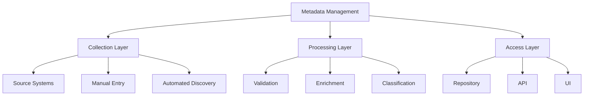
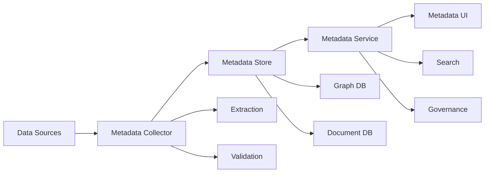

# Lesson 7.6: Metadata Management

## Navigation
- [← Back to Module Overview](./README.md)
- [Previous Lesson ←](./7.5-data-lineage.md)
- [Next Lesson →](./7.7-data-quality-in-modeling.md)

## Learning Objectives
- Understand metadata management principles
- Learn about metadata repositories
- Master metadata standards
- Practice metadata implementation

## Key Concepts

### Metadata Fundamentals
- Metadata Types
  - Technical Metadata
  - Business Metadata
  - Operational Metadata
  - Quality Metadata
- Metadata Standards
  - Dublin Core
  - ISO 11179
  - DCAM
  - FIBO
- Metadata Components
  - Data Definitions
  - Business Rules
  - Data Quality
  - Usage Statistics

### Metadata Implementation
- Repository Types
  - Centralized
  - Distributed
  - Federated
  - Hybrid
- Management Tools
  - Apache Atlas
  - Collibra
  - Informatica
  - Alation
- Integration Methods
  - API Integration
  - Event-Based
  - Batch Processing
  - Real-Time Sync

## Architecture Diagrams

### Metadata Management Framework


### Metadata Repository Architecture


## Configuration Examples

### Metadata Repository Configuration
```yaml
metadata_repository:
  name: enterprise_metadata
  type: distributed
  storage:
    primary:
      type: graph
      database: neo4j
      connection: bolt://localhost:7687
    secondary:
      type: document
      database: mongodb
      connection: mongodb://localhost:27017
  
  collectors:
    - name: database_collector
      type: jdbc
      schedule: "0 0 * * *"
      sources:
        - name: sales_db
          type: postgresql
          connection: jdbc:postgresql://sales-db:5432/sales
    - name: file_collector
      type: file_system
      schedule: "0 */4 * * *"
      paths:
        - /data/raw
        - /data/processed
```

### Metadata Definition
```yaml
metadata:
  entity:
    name: customer_data
    type: table
    description: "Customer information table"
    technical_metadata:
      schema: sales
      table: customers
      columns:
        - name: customer_id
          type: integer
          description: "Unique customer identifier"
          constraints:
            - primary_key
            - not_null
        - name: email
          type: varchar(255)
          description: "Customer email address"
          constraints:
            - unique
            - not_null
    business_metadata:
      owner: sales_team
      steward: data_governance
      classification: sensitive
      retention: 7_years
    quality_metadata:
      completeness: 99.9%
      accuracy: 99.5%
      freshness: daily
```

## Best Practices

### Metadata Management Guidelines
1. **Collection**
   - Automated discovery
   - Manual documentation
   - Regular updates
   - Quality checks

2. **Organization**
   - Clear structure
   - Consistent naming
   - Proper classification
   - Version control

3. **Access**
   - Role-based access
   - Audit logging
   - Change tracking
   - Usage monitoring

4. **Maintenance**
   - Regular updates
   - Quality checks
   - Performance monitoring
   - Storage management

## Real-World Case Studies

### Case Study 1: Enterprise Metadata
- **Challenge**: Implement enterprise metadata management
- **Solution**:
  - Centralized repository
  - Automated collection
  - Standardized definitions
  - Access control
- **Results**:
  - Better governance
  - Faster discovery
  - Improved quality
  - Reduced risk

### Case Study 2: Data Lake Metadata
- **Challenge**: Manage data lake metadata
- **Solution**:
  - Distributed repository
  - Real-time collection
  - Schema evolution
  - Quality tracking
- **Results**:
  - Better organization
  - Faster access
  - Improved trust
  - Efficient governance

## Common Pitfalls
- Poor organization
- Incomplete metadata
- Outdated information
- Access issues
- Performance problems

## Additional Resources
- Metadata Standards Guide
- Repository Tools
- Best Practices
- Case Studies

## Next Steps
- Learn about data quality
- Practice metadata management
- Explore repository tools
- Understand governance 