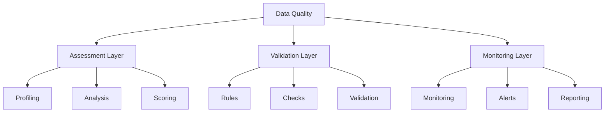
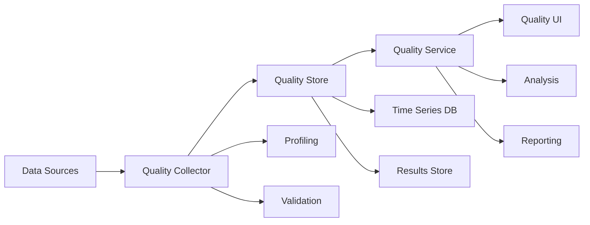

# Lesson 7.7: Data Quality in Modeling

## Navigation
- [← Back to Module Overview](./README.md)
- [Previous Lesson ←](./7.6-metadata-management.md)
- [Next Module →](../08-data-visualization-and-reporting/README.md)

## Learning Objectives
- Understand data quality principles
- Learn about quality metrics and validation
- Master quality monitoring techniques
- Practice quality implementation

## Key Concepts

### Data Quality Fundamentals
- Quality Dimensions
  - Accuracy
  - Completeness
  - Consistency
  - Timeliness
  - Validity
  - Uniqueness
- Quality Metrics
  - Error Rates
  - Completeness Rates
  - Consistency Scores
  - Freshness Metrics
- Quality Components
  - Data Profiling
  - Validation Rules
  - Monitoring
  - Reporting

### Quality Implementation
- Validation Methods
  - Rule-Based
  - Statistical
  - Pattern-Based
  - Reference-Based
- Monitoring Tools
  - Great Expectations
  - Deequ
  - Data Quality Framework
  - Custom Solutions
- Quality Processes
  - Assessment
  - Improvement
  - Monitoring
  - Reporting

## Architecture Diagrams

### Data Quality Framework


### Quality Monitoring Architecture


## Configuration Examples

### Quality Rules Configuration
```yaml
quality_rules:
  dataset: customer_data
  rules:
    - name: completeness_check
      type: completeness
      columns:
        - customer_id
        - email
        - name
      threshold: 99.9%
      action: alert
    
    - name: uniqueness_check
      type: uniqueness
      columns:
        - customer_id
        - email
      threshold: 100%
      action: fail
    
    - name: format_check
      type: format
      column: email
      pattern: "^[a-zA-Z0-9._%+-]+@[a-zA-Z0-9.-]+\\.[a-zA-Z]{2,}$"
      action: warn
    
    - name: range_check
      type: range
      column: age
      min: 18
      max: 100
      action: alert
```

### Quality Monitoring Setup
```yaml
quality_monitoring:
  name: customer_data_quality
  schedule: "0 */4 * * *"
  metrics:
    - name: completeness
      type: percentage
      threshold: 99.9%
      window: 24h
    - name: accuracy
      type: percentage
      threshold: 99.5%
      window: 24h
    - name: freshness
      type: timestamp
      threshold: 1h
      window: 24h
  
  alerts:
    - name: quality_alert
      type: email
      recipients:
        - data_team@company.com
      conditions:
        - metric: completeness
          operator: less_than
          value: 99.9%
        - metric: accuracy
          operator: less_than
          value: 99.5%
```

## Best Practices

### Quality Implementation Guidelines
1. **Assessment**
   - Regular profiling
   - Metric tracking
   - Trend analysis
   - Root cause analysis

2. **Validation**
   - Clear rules
   - Proper thresholds
   - Action definitions
   - Error handling

3. **Monitoring**
   - Real-time checks
   - Automated alerts
   - Performance tracking
   - Resource management

4. **Improvement**
   - Regular reviews
   - Rule updates
   - Process optimization
   - Team training

## Real-World Case Studies

### Case Study 1: Financial Data Quality
- **Challenge**: Ensure financial data quality
- **Solution**:
  - Comprehensive rules
  - Real-time monitoring
  - Automated validation
  - Quality reporting
- **Results**:
  - Better accuracy
  - Faster detection
  - Reduced errors
  - Improved trust

### Case Study 2: Healthcare Data Quality
- **Challenge**: Maintain healthcare data quality
- **Solution**:
  - HIPAA compliance
  - Patient validation
  - Clinical rules
  - Audit tracking
- **Results**:
  - Regulatory compliance
  - Better care
  - Reduced risk
  - Improved outcomes

## Common Pitfalls
- Poor rule design
- Missing metrics
- Inadequate monitoring
- False positives
- Resource constraints

## Additional Resources
- Quality Tools Guide
- Best Practices
- Industry Standards
- Case Studies

## Next Steps
- Learn about data governance
- Practice quality implementation
- Explore monitoring tools
- Understand compliance 