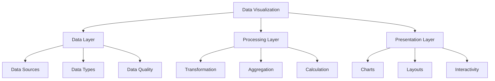
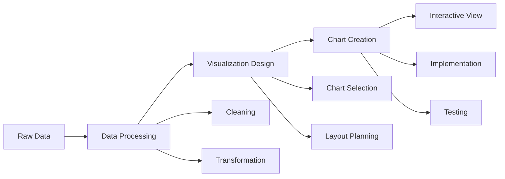

# Lesson 8.1: Introduction to Data Visualization

## Navigation
- [← Back to Module Overview](./README.md)
- [Next Lesson →](./8.2-power-bi-fundamentals.md)

## Learning Objectives
- Understand visualization principles and best practices
- Learn about different chart types and their use cases
- Master data storytelling techniques
- Practice effective visualization design

## Key Concepts

### Visualization Fundamentals
- Core Principles
  - Clarity
  - Accuracy
  - Efficiency
  - Aesthetics
- Data Types
  - Categorical
  - Numerical
  - Temporal
  - Hierarchical
- Visualization Goals
  - Exploration
  - Analysis
  - Communication
  - Decision Making

### Chart Types and Use Cases
- Basic Charts
  - Bar Charts
  - Line Charts
  - Scatter Plots
  - Pie Charts
- Advanced Charts
  - Heat Maps
  - Box Plots
  - Network Graphs
  - Treemaps
- Specialized Charts
  - Gantt Charts
  - Sankey Diagrams
  - Radar Charts
  - Bubble Charts

## Architecture Diagrams

### Visualization Framework


### Visualization Pipeline


## Configuration Examples

### Chart Configuration
```yaml
visualization:
  name: sales_dashboard
  type: dashboard
  layout:
    grid: 2x2
    responsive: true
  charts:
    - name: sales_trend
      type: line
      data:
        source: sales_data
        x: date
        y: amount
      style:
        color: "#2E7D32"
        line_width: 2
      interactivity:
        hover: true
        zoom: true
    
    - name: product_distribution
      type: pie
      data:
        source: product_data
        value: sales
        label: product_name
      style:
        colors: ["#1976D2", "#388E3C", "#F57C00"]
      interactivity:
        click: true
        legend: true
```

### Dashboard Layout
```yaml
dashboard:
  name: executive_overview
  sections:
    - name: key_metrics
      layout: row
      components:
        - type: kpi
          title: "Total Sales"
          value: "=SUM(sales.amount)"
          format: currency
        - type: kpi
          title: "Growth Rate"
          value: "=GROWTH_RATE(sales.amount)"
          format: percentage
    
    - name: trends
      layout: column
      components:
        - type: chart
          title: "Sales Trend"
          chart_type: line
          data_source: sales_trend
        - type: chart
          title: "Product Mix"
          chart_type: pie
          data_source: product_distribution
```

## Best Practices

### Visualization Guidelines
1. **Data Preparation**
   - Clean data
   - Choose right format
   - Handle outliers
   - Consider context

2. **Chart Selection**
   - Match data type
   - Consider audience
   - Show relationships
   - Avoid distortion

3. **Design Principles**
   - Clear labels
   - Consistent colors
   - Proper scaling
   - Effective use of space

4. **Storytelling**
   - Clear narrative
   - Logical flow
   - Key insights
   - Action items

## Real-World Case Studies

### Case Study 1: Sales Analytics Dashboard
- **Challenge**: Create executive sales dashboard
- **Solution**:
  - Key metrics display
  - Trend visualization
  - Product analysis
  - Interactive features
- **Results**:
  - Better insights
  - Faster decisions
  - Improved communication
  - Increased efficiency

### Case Study 2: Healthcare Analytics
- **Challenge**: Visualize patient outcomes
- **Solution**:
  - Outcome tracking
  - Treatment analysis
  - Risk assessment
  - Performance metrics
- **Results**:
  - Better care
  - Improved outcomes
  - Cost reduction
  - Quality improvement

## Common Pitfalls
- Poor chart selection
- Data distortion
- Cluttered design
- Missing context
- Ineffective storytelling

## Additional Resources
- Visualization Tools Guide
- Chart Selection Guide
- Best Practices
- Case Studies

## Next Steps
- Learn Power BI
- Practice visualization
- Explore chart types
- Master storytelling 