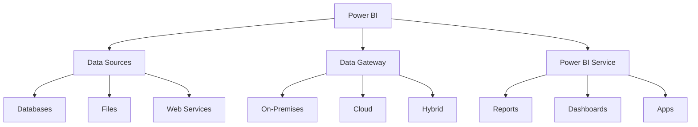
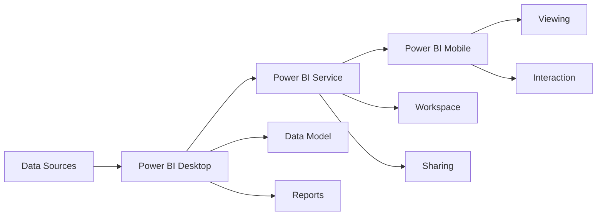

# Lesson 8.2: Power BI Fundamentals

## Navigation
- [← Back to Module Overview](./README.md)
- [Previous Lesson ←](./8.1-introduction-to-data-visualization.md)
- [Next Lesson →](./8.3-tableau-fundamentals.md)

## Learning Objectives
- Understand Power BI components and architecture
- Learn about data modeling in Power BI
- Master basic visualization creation
- Practice report development

## Key Concepts

### Power BI Components
- Core Components
  - Power BI Desktop
  - Power BI Service
  - Power BI Mobile
  - Power BI Gateway
- Data Sources
  - Databases
  - Files
  - Web Services
  - Streaming Data
- Report Elements
  - Pages
  - Visuals
  - Filters
  - Slicers

### Data Modeling
- Data Model Types
  - Star Schema
  - Snowflake Schema
  - Flat Tables
  - Custom Models
- Relationships
  - One-to-Many
  - Many-to-Many
  - One-to-One
  - Bidirectional
- Calculations
  - DAX Formulas
  - Measures
  - Calculated Columns
  - Calculated Tables

## Architecture Diagrams

### Power BI Architecture


### Data Flow Architecture


## Configuration Examples

### Power BI Report Configuration
```yaml
power_bi_report:
  name: sales_analytics
  data_sources:
    - name: sales_db
      type: sql_server
      connection: "Server=server;Database=sales;Trusted_Connection=True;"
      tables:
        - name: sales
          columns:
            - name: sale_id
              type: integer
            - name: date
              type: datetime
            - name: amount
              type: decimal
    
    - name: products
      type: excel
      path: "C:/Data/products.xlsx"
      sheets:
        - name: product_list
  
  visuals:
    - name: sales_trend
      type: line_chart
      data:
        x: sales.date
        y: sales.amount
      filters:
        - field: sales.date
          type: date_range
          default: last_30_days
    
    - name: product_distribution
      type: pie_chart
      data:
        values: sales.amount
        labels: products.name
      filters:
        - field: sales.date
          type: date_range
```

### DAX Measures
```yaml
dax_measures:
  - name: total_sales
    formula: "=SUM(sales[amount])"
    format: currency
    description: "Total sales amount"
  
  - name: average_order_value
    formula: "=DIVIDE(SUM(sales[amount]), COUNTROWS(sales))"
    format: currency
    description: "Average value per order"
  
  - name: year_to_date_sales
    formula: "=TOTALYTD(SUM(sales[amount]), sales[date])"
    format: currency
    description: "Year-to-date sales"
```

## Best Practices

### Power BI Development Guidelines
1. **Data Modeling**
   - Use star schema
   - Optimize relationships
   - Create calculated columns
   - Define measures

2. **Visualization**
   - Choose appropriate charts
   - Use consistent colors
   - Apply proper filters
   - Enable interactivity

3. **Performance**
   - Optimize data model
   - Use appropriate visuals
   - Implement row-level security
   - Monitor refresh times

4. **Maintenance**
   - Document changes
   - Version control
   - Regular updates
   - User training

## Real-World Case Studies

### Case Study 1: Sales Analytics
- **Challenge**: Create sales dashboard
- **Solution**:
  - Star schema model
  - Key metrics
  - Interactive reports
  - Real-time updates
- **Results**:
  - Better insights
  - Faster decisions
  - Improved efficiency
  - Increased sales

### Case Study 2: Financial Reporting
- **Challenge**: Build financial dashboard
- **Solution**:
  - Complex calculations
  - Multiple data sources
  - Custom visuals
  - Role-based access
- **Results**:
  - Accurate reporting
  - Better control
  - Faster analysis
  - Improved compliance

## Common Pitfalls
- Poor data modeling
- Inefficient DAX
- Complex visuals
- Missing documentation
- Performance issues

## Additional Resources
- Power BI Documentation
- DAX Guide
- Best Practices
- Community Forums

## Next Steps
- Learn Tableau
- Practice DAX
- Explore advanced features
- Master sharing 