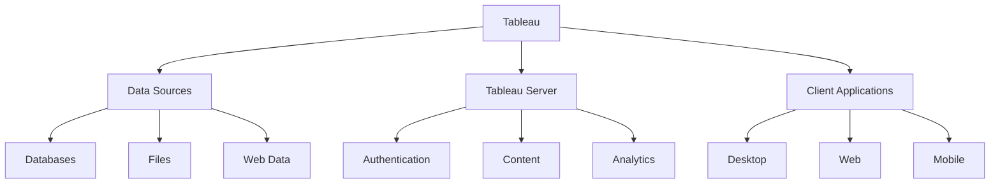
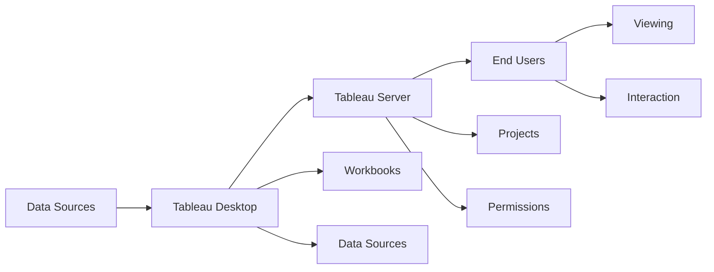

# Lesson 8.3: Tableau Fundamentals

## Navigation
- [← Back to Module Overview](./README.md)
- [Previous Lesson ←](./8.2-power-bi-fundamentals.md)
- [Next Lesson →](./8.4-advanced-visualization-techniques.md)

## Learning Objectives
- Understand Tableau interface and components
- Learn about data connections and preparation
- Master basic visualization creation
- Practice workbook development

## Key Concepts

### Tableau Components
- Core Components
  - Tableau Desktop
  - Tableau Server
  - Tableau Public
  - Tableau Mobile
- Data Sources
  - Live Connections
  - Extracts
  - Published Sources
  - Custom SQL
- Workbook Elements
  - Worksheets
  - Dashboards
  - Stories
  - Parameters

### Data Preparation
- Data Connection
  - Direct Connection
  - Data Extract
  - Custom SQL
  - Web Connector
- Data Processing
  - Data Cleaning
  - Field Calculations
  - Level of Detail
  - Table Calculations
- Data Modeling
  - Relationships
  - Joins
  - Unions
  - Blending

## Architecture Diagrams

### Tableau Architecture


### Data Flow Architecture


## Configuration Examples

### Tableau Workbook Configuration
```yaml
tableau_workbook:
  name: sales_analytics
  data_sources:
    - name: sales_db
      type: postgresql
      connection: "Host=server;Database=sales;Port=5432"
      tables:
        - name: sales
          columns:
            - name: sale_id
              type: integer
            - name: date
              type: date
            - name: amount
              type: decimal
    
    - name: products
      type: excel
      path: "C:/Data/products.xlsx"
      sheets:
        - name: product_list
  
  worksheets:
    - name: sales_trend
      type: line_chart
      data:
        x: sales.date
        y: sales.amount
      filters:
        - field: sales.date
          type: date_range
          default: last_30_days
    
    - name: product_distribution
      type: pie_chart
      data:
        values: sales.amount
        labels: products.name
      filters:
        - field: sales.date
          type: date_range
```

### Tableau Calculations
```yaml
tableau_calculations:
  - name: total_sales
    type: measure
    formula: "SUM([amount])"
    format: currency
    description: "Total sales amount"
  
  - name: average_order_value
    type: measure
    formula: "SUM([amount]) / COUNT([sale_id])"
    format: currency
    description: "Average value per order"
  
  - name: year_to_date_sales
    type: measure
    formula: "WINDOW_SUM(SUM([amount]), -INF, 0)"
    format: currency
    description: "Year-to-date sales"
```

## Best Practices

### Tableau Development Guidelines
1. **Data Preparation**
   - Clean data
   - Create extracts
   - Optimize connections
   - Use parameters

2. **Visualization**
   - Choose right charts
   - Use consistent colors
   - Apply filters
   - Enable interactivity

3. **Performance**
   - Optimize extracts
   - Use appropriate filters
   - Limit data size
   - Monitor refresh times

4. **Maintenance**
   - Document workbooks
   - Version control
   - Regular updates
   - User training

## Real-World Case Studies

### Case Study 1: Sales Analytics
- **Challenge**: Create sales dashboard
- **Solution**:
  - Data extracts
  - Key metrics
  - Interactive dashboards
  - Real-time updates
- **Results**:
  - Better insights
  - Faster decisions
  - Improved efficiency
  - Increased sales

### Case Study 2: Marketing Analytics
- **Challenge**: Build marketing dashboard
- **Solution**:
  - Multiple data sources
  - Custom calculations
  - Story points
  - Mobile optimization
- **Results**:
  - Better tracking
  - Improved ROI
  - Faster analysis
  - Better decisions

## Common Pitfalls
- Poor data preparation
- Complex calculations
- Overloaded dashboards
- Missing documentation
- Performance issues

## Additional Resources
- Tableau Documentation
- Training Resources
- Best Practices
- Community Forums

## Next Steps
- Learn advanced features
- Practice calculations
- Explore server features
- Master sharing 