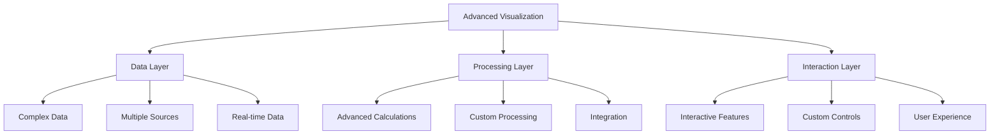
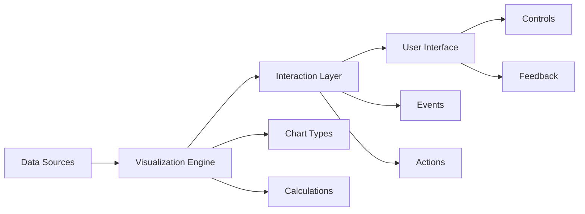

# Lesson 8.4: Advanced Visualization Techniques

## Navigation
- [← Back to Module Overview](./README.md)
- [Previous Lesson ←](./8.3-tableau-fundamentals.md)
- [Next Lesson →](./8.5-dashboard-design.md)

## Learning Objectives
- Understand advanced chart types and their applications
- Learn about interactive visualization features
- Master custom visualization development
- Practice advanced visualization implementation

## Key Concepts

### Advanced Chart Types
- Complex Charts
  - Waterfall Charts
  - Bullet Charts
  - Sparklines
  - Small Multiples
- Specialized Charts
  - Geographic Maps
  - Network Diagrams
  - Chord Diagrams
  - Sunburst Charts
- Custom Charts
  - Custom Visuals
  - R Integration
  - Python Integration
  - JavaScript Extensions

### Interactive Features
- Advanced Interactivity
  - Drill-Down
  - Cross-Filtering
  - Dynamic Parameters
  - Custom Actions
- User Experience
  - Tooltips
  - Highlights
  - Selections
  - Animations
- Custom Interactions
  - Custom Buttons
  - Dynamic Titles
  - Conditional Formatting
  - Custom Navigation

## Architecture Diagrams

### Advanced Visualization Framework


### Interactive Architecture


## Configuration Examples

### Advanced Chart Configuration
```yaml
advanced_visualization:
  name: complex_dashboard
  type: interactive
  charts:
    - name: waterfall_chart
      type: waterfall
      data:
        source: financial_data
        category: account
        value: amount
        running_total: true
      style:
        colors:
          positive: "#4CAF50"
          negative: "#F44336"
          total: "#2196F3"
      interactivity:
        drill_down: true
        tooltips: custom
    
    - name: geographic_map
      type: map
      data:
        source: location_data
        location: coordinates
        size: value
        color: category
      style:
        map_type: satellite
        clustering: true
      interactivity:
        zoom: true
        pan: true
        selection: true
```

### Custom Interaction Configuration
```yaml
interaction_config:
  name: sales_analytics
  interactions:
    - name: cross_filter
      type: filter
      source: sales_chart
      target: product_chart
      action: filter
      direction: bidirectional
    
    - name: drill_down
      type: navigation
      source: region_map
      target: city_view
      hierarchy:
        - region
        - state
        - city
    
    - name: dynamic_title
      type: update
      source: date_filter
      target: chart_title
      format: "Sales Analysis for {date}"
```

## Best Practices

### Advanced Visualization Guidelines
1. **Chart Selection**
   - Match complexity to data
   - Consider user expertise
   - Balance aesthetics
   - Ensure clarity

2. **Interactivity**
   - Intuitive controls
   - Responsive feedback
   - Clear navigation
   - Performance optimization

3. **Custom Development**
   - Modular design
   - Reusable components
   - Error handling
   - Documentation

4. **User Experience**
   - Clear instructions
   - Consistent behavior
   - Helpful tooltips
   - Performance feedback

## Real-World Case Studies

### Case Study 1: Financial Analytics
- **Challenge**: Create complex financial dashboard
- **Solution**:
  - Waterfall charts
  - Interactive filters
  - Custom calculations
  - Drill-down views
- **Results**:
  - Better analysis
  - Faster insights
  - Improved decisions
  - Enhanced reporting

### Case Study 2: Geographic Analysis
- **Challenge**: Visualize geographic data
- **Solution**:
  - Interactive maps
  - Clustering
  - Custom overlays
  - Dynamic filtering
- **Results**:
  - Better location insights
  - Improved planning
  - Faster analysis
  - Better decisions

## Common Pitfalls
- Over-complex charts
- Poor performance
- Confusing interactions
- Missing documentation
- Inconsistent behavior

## Additional Resources
- Advanced Chart Guides
- Interaction Patterns
- Custom Development
- Best Practices

## Next Steps
- Learn dashboard design
- Practice custom development
- Explore integration options
- Master performance 