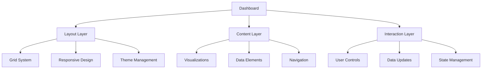
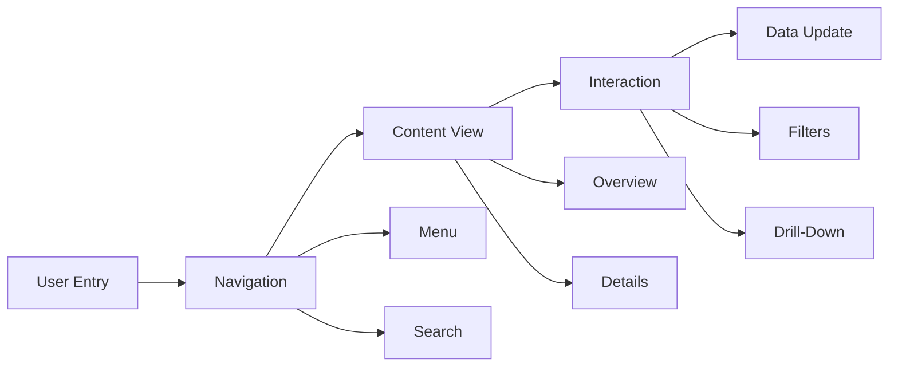

# Lesson 8.5: Dashboard Design

## Navigation
- [← Back to Module Overview](./README.md)
- [Previous Lesson ←](./8.4-advanced-visualization-techniques.md)
- [Next Lesson →](./8.6-data-warehouse-integration.md)

## Learning Objectives
- Understand dashboard design principles
- Learn about user experience best practices
- Master layout and organization techniques
- Practice dashboard development

## Key Concepts

### Dashboard Fundamentals
- Design Principles
  - Clarity
  - Consistency
  - Hierarchy
  - Balance
- Layout Types
  - Grid Layout
  - Z-Pattern
  - F-Pattern
  - Custom Layouts
- User Experience
  - Navigation
  - Interaction
  - Responsiveness
  - Accessibility

### Dashboard Components
- Core Elements
  - KPIs
  - Charts
  - Tables
  - Filters
- Navigation
  - Menus
  - Tabs
  - Breadcrumbs
  - Links
- Interactive Features
  - Drill-Downs
  - Filters
  - Parameters
  - Actions

## Architecture Diagrams

### Dashboard Architecture


### User Experience Flow


## Configuration Examples

### Dashboard Layout Configuration
```yaml
dashboard_layout:
  name: executive_dashboard
  theme:
    primary_color: "#1976D2"
    secondary_color: "#388E3C"
    background_color: "#FFFFFF"
    text_color: "#333333"
  
  layout:
    type: grid
    columns: 12
    rows: 8
    sections:
      - name: header
        position: top
        height: 60px
        components:
          - type: title
            text: "Executive Overview"
            style: large
          - type: date_filter
            position: right
    
      - name: kpi_section
        position: top
        height: 120px
        components:
          - type: kpi_grid
            columns: 4
            items:
              - name: total_sales
                title: "Total Sales"
                format: currency
              - name: growth_rate
                title: "Growth Rate"
                format: percentage
              - name: customer_count
                title: "Customers"
                format: number
              - name: avg_order
                title: "Avg Order"
                format: currency
    
      - name: main_content
        position: middle
        height: auto
        components:
          - type: chart_grid
            columns: 2
            items:
              - name: sales_trend
                type: line_chart
                title: "Sales Trend"
              - name: product_mix
                type: pie_chart
                title: "Product Mix"
```

### User Experience Configuration
```yaml
user_experience:
  name: sales_dashboard
  navigation:
    type: hierarchical
    structure:
      - name: overview
        icon: dashboard
        components:
          - name: kpi_summary
          - name: sales_trends
      - name: products
        icon: inventory
        components:
          - name: product_performance
          - name: category_analysis
      - name: customers
        icon: people
        components:
          - name: customer_segments
          - name: loyalty_analysis
  
  interactions:
    - name: cross_filter
      type: filter
      source: date_range
      targets: all_charts
    
    - name: drill_down
      type: navigation
      source: region_map
      target: city_view
    
    - name: export
      type: action
      target: excel
      format: xlsx
```

## Best Practices

### Dashboard Design Guidelines
1. **Layout Design**
   - Clear hierarchy
   - Logical grouping
   - Consistent spacing
   - Responsive design

2. **Content Organization**
   - Important first
   - Logical flow
   - Clear sections
   - Easy navigation

3. **User Experience**
   - Intuitive controls
   - Clear feedback
   - Consistent behavior
   - Performance focus

4. **Maintenance**
   - Modular design
   - Version control
   - Documentation
   - User training

## Real-World Case Studies

### Case Study 1: Executive Dashboard
- **Challenge**: Create executive overview
- **Solution**:
  - KPI-focused layout
  - Clear hierarchy
  - Interactive features
  - Mobile optimization
- **Results**:
  - Better insights
  - Faster decisions
  - Improved efficiency
  - Enhanced reporting

### Case Study 2: Operations Dashboard
- **Challenge**: Build operations dashboard
- **Solution**:
  - Real-time updates
  - Alert system
  - Drill-down views
  - Custom actions
- **Results**:
  - Better monitoring
  - Faster response
  - Improved efficiency
  - Better control

## Common Pitfalls
- Poor layout
- Cluttered design
- Confusing navigation
- Missing documentation
- Performance issues

## Additional Resources
- Design Guidelines
- Layout Patterns
- UX Best Practices
- Case Studies

## Next Steps
- Learn data warehouse integration
- Practice dashboard development
- Explore advanced features
- Master performance 