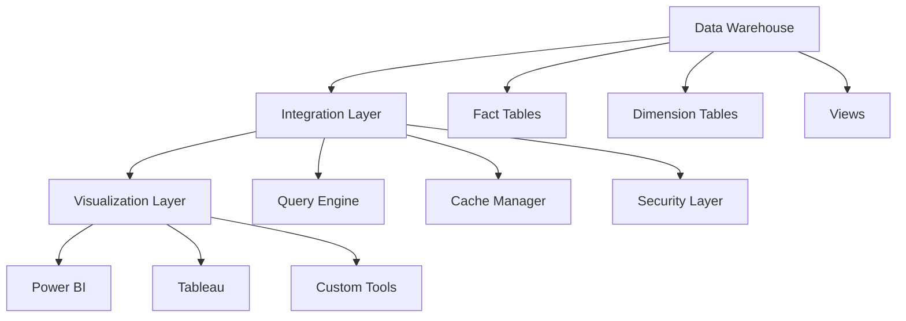
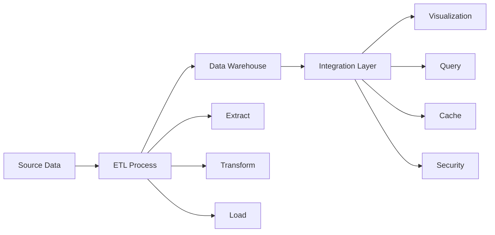

# Lesson 8.6: Data Warehouse Integration

## Navigation
- [← Back to Module Overview](./README.md)
- [Previous Lesson ←](./8.5-dashboard-design.md)
- [Next Lesson →](./8.7-advanced-analytics-integration.md)

## Learning Objectives
- Understand data warehouse integration patterns
- Learn about data modeling for visualization
- Master performance optimization techniques
- Practice integration implementation

## Key Concepts

### Integration Fundamentals
- Connection Types
  - Direct Query
  - Import Mode
  - Hybrid Mode
  - Live Connection
- Data Models
  - Star Schema
  - Snowflake Schema
  - Fact Tables
  - Dimension Tables
- Performance
  - Query Optimization
  - Caching
  - Incremental Refresh
  - Materialized Views

### Integration Components
- Data Sources
  - Tables
  - Views
  - Stored Procedures
  - Custom Queries
- Transformations
  - Data Cleansing
  - Aggregation
  - Calculation
  - Custom Logic
- Security
  - Row-Level Security
  - Column-Level Security
  - User Permissions
  - Data Masking

## Architecture Diagrams

### Integration Architecture


### Data Flow Architecture


## Configuration Examples

### Data Source Configuration
```yaml
data_source:
  name: sales_warehouse
  type: sql_server
  connection:
    server: "warehouse.database.windows.net"
    database: "sales_db"
    authentication: "azure_ad"
  
  tables:
    - name: fact_sales
      type: fact
      refresh_type: incremental
      refresh_column: sale_date
      relationships:
        - name: dim_customer
          type: foreign_key
          column: customer_id
        - name: dim_product
          type: foreign_key
          column: product_id
    
    - name: dim_customer
      type: dimension
      refresh_type: full
      columns:
        - name: customer_id
          type: key
        - name: customer_name
          type: attribute
        - name: customer_segment
          type: attribute
    
    - name: dim_product
      type: dimension
      refresh_type: full
      columns:
        - name: product_id
          type: key
        - name: product_name
          type: attribute
        - name: category
          type: attribute
```

### Performance Configuration
```yaml
performance:
  name: sales_dashboard
  optimization:
    query_mode: direct_query
    caching:
      enabled: true
      duration: 1h
      tables:
        - name: dim_customer
          refresh: daily
        - name: dim_product
          refresh: daily
    
    materialization:
      enabled: true
      tables:
        - name: sales_summary
          refresh: hourly
          columns:
            - date
            - customer_segment
            - total_sales
            - total_quantity
    
    security:
      row_level:
        enabled: true
        tables:
          - name: fact_sales
            filter: "region = USER_REGION()"
          - name: dim_customer
            filter: "sales_rep = USER_ID()"
```

## Best Practices

### Integration Guidelines
1. **Data Modeling**
   - Use star schema
   - Optimize relationships
   - Implement hierarchies
   - Handle slowly changing dimensions

2. **Performance**
   - Optimize queries
   - Use appropriate modes
   - Implement caching
   - Monitor performance

3. **Security**
   - Implement RLS
   - Secure connections
   - Manage permissions
   - Audit access

4. **Maintenance**
   - Monitor refresh
   - Update statistics
   - Clean up cache
   - Version control

## Real-World Case Studies

### Case Study 1: Retail Analytics
- **Challenge**: Integrate retail data
- **Solution**:
  - Star schema design
  - Incremental refresh
  - Materialized views
  - Security rules
- **Results**:
  - Faster queries
  - Better security
  - Reduced load
  - Improved insights

### Case Study 2: Financial Reporting
- **Challenge**: Build financial dashboard
- **Solution**:
  - Snowflake schema
  - Custom calculations
  - Row-level security
  - Performance tuning
- **Results**:
  - Accurate reporting
  - Secure access
  - Fast performance
  - Better analysis

## Common Pitfalls
- Poor schema design
- Missing indexes
- Inefficient queries
- Security gaps
- Performance issues

## Additional Resources
- Data Modeling Guides
- Performance Tuning
- Security Best Practices
- Integration Patterns

## Next Steps
- Learn advanced optimization
- Practice integration
- Explore security features
- Master monitoring 