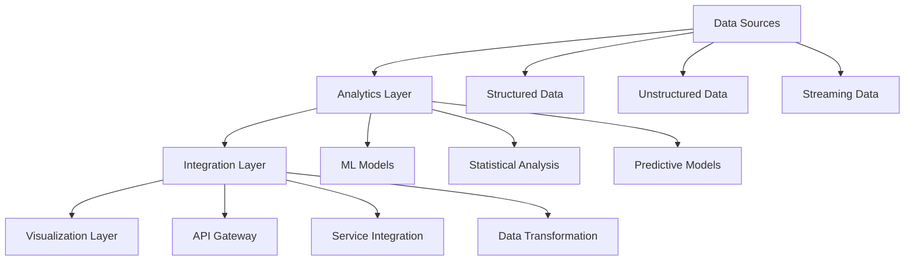
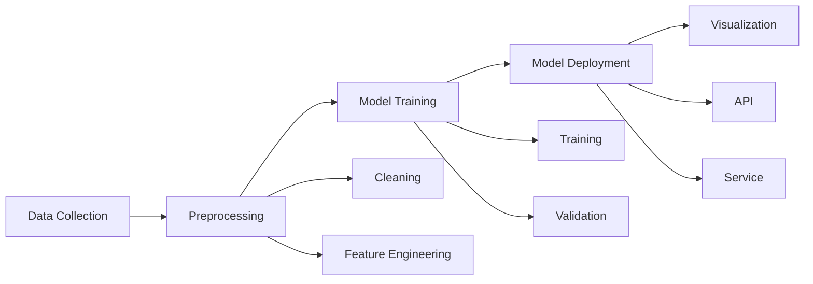

# Lesson 8.7: Advanced Analytics Integration

## Navigation
- [← Back to Module Overview](./README.md)
- [Previous Lesson ←](./8.6-data-warehouse-integration.md)
- [Next Lesson →](./8.8-reporting-best-practices.md)

## Learning Objectives
- Understand advanced analytics concepts
- Learn about predictive modeling integration
- Master machine learning visualization
- Practice advanced analytics implementation

## Key Concepts

### Advanced Analytics Fundamentals
- Analytics Types
  - Predictive Analytics
  - Prescriptive Analytics
  - Diagnostic Analytics
  - Descriptive Analytics
- Integration Methods
  - API Integration
  - Custom Functions
  - R/Python Integration
  - External Services
- Visualization Types
  - Forecast Charts
  - Scatter Plots
  - Heat Maps
  - Decision Trees

### Integration Components
- Data Processing
  - Feature Engineering
  - Data Preparation
  - Model Training
  - Model Deployment
- Analytics Services
  - Azure ML
  - AWS SageMaker
  - Google AI Platform
  - Custom Solutions
- Visualization Tools
  - Custom Charts
  - Interactive Features
  - Dynamic Updates
  - Real-time Analytics

## Architecture Diagrams

### Analytics Integration Architecture


### Analytics Flow Architecture


## Configuration Examples

### Analytics Integration Configuration
```yaml
analytics_integration:
  name: sales_forecast
  data_sources:
    - name: historical_sales
      type: sql
      refresh: daily
      features:
        - name: date
          type: datetime
        - name: sales_amount
          type: numeric
        - name: product_id
          type: categorical
    
    - name: market_data
      type: api
      refresh: hourly
      features:
        - name: market_index
          type: numeric
        - name: sentiment_score
          type: numeric
  
  models:
    - name: sales_forecast
      type: time_series
      algorithm: prophet
      parameters:
        seasonality_mode: multiplicative
        changepoint_prior_scale: 0.05
      training:
        frequency: weekly
        horizon: 90
    
    - name: customer_segmentation
      type: clustering
      algorithm: kmeans
      parameters:
        n_clusters: 5
      features:
        - recency
        - frequency
        - monetary
  
  visualization:
    - name: forecast_chart
      type: line
      data: sales_forecast
      features:
        - actual
        - predicted
        - confidence_interval
    
    - name: segment_analysis
      type: scatter
      data: customer_segmentation
      features:
        - x: recency
        - y: frequency
        - color: segment
```

### Machine Learning Configuration
```yaml
machine_learning:
  name: predictive_analytics
  services:
    - name: azure_ml
      type: cloud
      endpoints:
        - name: forecast
          url: "https://api.azureml.net/forecast"
          method: POST
          parameters:
            - name: data
              type: json
            - name: horizon
              type: integer
    
    - name: custom_model
      type: local
      path: "models/sales_model.pkl"
      requirements:
        - scikit-learn
        - pandas
        - numpy
  
  integration:
    - name: power_bi
      type: custom_function
      language: python
      code: |
        def predict_sales(data):
            model = load_model()
            return model.predict(data)
    
    - name: tableau
      type: external_service
      service: azure_ml
      endpoint: forecast
```

## Best Practices

### Analytics Integration Guidelines
1. **Data Management**
   - Clean data
   - Feature engineering
   - Data validation
   - Version control

2. **Model Management**
   - Model versioning
   - Performance monitoring
   - Regular retraining
   - A/B testing

3. **Integration**
   - API design
   - Error handling
   - Performance optimization
   - Security measures

4. **Visualization**
   - Clear presentation
   - Interactive features
   - Real-time updates
   - User feedback

## Real-World Case Studies

### Case Study 1: Sales Forecasting
- **Challenge**: Predict sales trends
- **Solution**:
  - Time series model
  - Feature engineering
  - API integration
  - Interactive charts
- **Results**:
  - Accurate forecasts
  - Better planning
  - Improved decisions
  - Cost savings

### Case Study 2: Customer Analytics
- **Challenge**: Customer segmentation
- **Solution**:
  - Clustering model
  - Real-time updates
  - Custom visualizations
  - Integration pipeline
- **Results**:
  - Better targeting
  - Improved engagement
  - Higher retention
  - Increased revenue

## Common Pitfalls
- Poor data quality
- Model overfitting
- Integration issues
- Performance problems
- Security concerns

## Additional Resources
- ML Documentation
- Integration Guides
- Best Practices
- Case Studies

## Next Steps
- Learn advanced ML
- Practice integration
- Explore new models
- Master deployment 