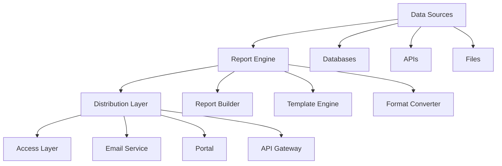
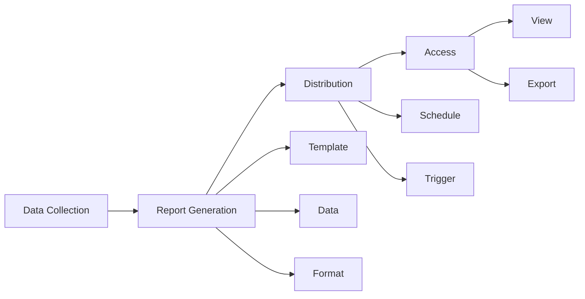

# Lesson 8.8: Reporting Best Practices

## Navigation
- [← Back to Module Overview](./README.md)
- [Previous Lesson ←](./8.7-advanced-analytics-integration.md)
- [Next Module →](../09-interview-preparation-and-soft-skills/README.md)

## Learning Objectives
- Understand reporting principles
- Learn about report design patterns
- Master report automation
- Practice report implementation

## Key Concepts

### Reporting Fundamentals
- Report Types
  - Operational Reports
  - Analytical Reports
  - Strategic Reports
  - Executive Reports
- Design Principles
  - Clarity
  - Consistency
  - Relevance
  - Actionability
- Automation
  - Scheduled Reports
  - Triggered Reports
  - Interactive Reports
  - Real-time Reports

### Report Components
- Content Structure
  - Executive Summary
  - Key Metrics
  - Detailed Analysis
  - Recommendations
- Visual Elements
  - Charts
  - Tables
  - KPIs
  - Filters
- Distribution
  - Email Delivery
  - Portal Access
  - Mobile View
  - Export Options

## Architecture Diagrams

### Reporting Architecture


### Report Flow Architecture


## Configuration Examples

### Report Configuration
```yaml
report:
  name: monthly_performance
  type: analytical
  schedule:
    frequency: monthly
    day: 1
    time: "06:00"
  
  sections:
    - name: executive_summary
      type: summary
      content:
        - type: kpi_grid
          metrics:
            - name: revenue_growth
              title: "Revenue Growth"
              format: percentage
            - name: customer_satisfaction
              title: "Customer Satisfaction"
              format: score
        - type: trend_chart
          title: "Key Metrics Trend"
          metrics:
            - revenue
            - customers
            - satisfaction
    
    - name: detailed_analysis
      type: analysis
      content:
        - type: data_table
          title: "Performance by Region"
          columns:
            - region
            - revenue
            - growth
            - market_share
        - type: chart_grid
          title: "Regional Analysis"
          charts:
            - type: bar
              title: "Revenue by Region"
            - type: pie
              title: "Market Share"
    
    - name: recommendations
      type: insights
      content:
        - type: bullet_list
          title: "Key Findings"
        - type: action_items
          title: "Recommended Actions"
```

### Distribution Configuration
```yaml
distribution:
  name: report_distribution
  channels:
    - name: email
      type: scheduled
      recipients:
        - group: executives
          format: pdf
        - group: managers
          format: excel
      schedule:
        frequency: monthly
        day: 1
        time: "06:00"
    
    - name: portal
      type: interactive
      access:
        - role: viewer
          permissions:
            - view
            - export
        - role: analyst
          permissions:
            - view
            - export
            - filter
            - drill
    
    - name: api
      type: on_demand
      endpoints:
        - name: report_data
          method: GET
          format: json
          authentication: oauth2
```

## Best Practices

### Reporting Guidelines
1. **Design Principles**
   - Clear structure
   - Consistent style
   - Relevant content
   - Actionable insights

2. **Content Management**
   - Regular updates
   - Version control
   - Quality checks
   - User feedback

3. **Distribution**
   - Right audience
   - Right format
   - Right timing
   - Access control

4. **Maintenance**
   - Performance monitoring
   - Error handling
   - User training
   - Documentation

## Real-World Case Studies

### Case Study 1: Financial Reporting
- **Challenge**: Streamline reporting
- **Solution**:
  - Automated reports
  - Interactive dashboards
  - Role-based access
  - Mobile optimization
- **Results**:
  - Faster delivery
  - Better insights
  - Improved efficiency
  - Cost reduction

### Case Study 2: Sales Reporting
- **Challenge**: Real-time insights
- **Solution**:
  - Live dashboards
  - Custom alerts
  - Drill-down views
  - Export options
- **Results**:
  - Better decisions
  - Faster response
  - Higher accuracy
  - Increased sales

## Common Pitfalls
- Poor design
- Missing data
- Late delivery
- Access issues
- Performance problems

## Additional Resources
- Design Guidelines
- Best Practices
- Templates
- Case Studies

## Next Steps
- Learn advanced features
- Practice automation
- Explore new tools
- Master distribution 