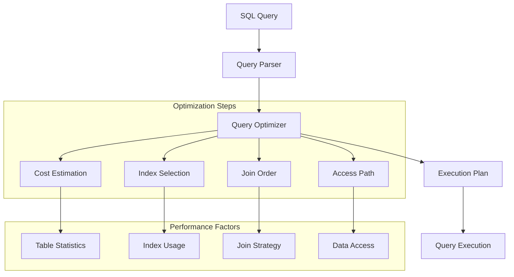

# Lesson 9.1: SQL Interview Preparation

## Navigation
- [← Back to Module Overview](./README.md)
- [Next Lesson →](./9.2-python-interview-preparation.md)

## Learning Objectives

- Master essential SQL concepts and syntax for technical interviews
- Understand common SQL interview questions and their solutions
- Learn query optimization techniques and best practices
- Develop problem-solving strategies for SQL challenges

## Key Concepts

### SQL Fundamentals Review
- Basic SQL syntax and commands
- Data types and constraints
- Joins and relationships
- Aggregations and grouping
- Subqueries and CTEs
- Window functions

### Common Interview Topics
- Complex joins and relationships
- Performance optimization
- Data manipulation
- Data analysis scenarios
- Database design principles

### Query Optimization
- Index usage and optimization
- Query execution plans
- Performance tuning techniques
- Best practices for efficient queries

## Practice Problems

### Basic to Intermediate
1. Find duplicate records in a table
2. Calculate running totals
3. Find nth highest salary
4. Compare current row with previous/next row
5. Pivot table operations

### Advanced
1. Complex joins with multiple conditions
2. Recursive CTEs
3. Window functions for analytics
4. Performance optimization scenarios
5. Database design challenges

## Interview Tips

### Problem-Solving Approach
1. Understand the requirements clearly
2. Break down complex problems
3. Start with a simple solution
4. Optimize for performance
5. Consider edge cases

### Common Pitfalls to Avoid
- Forgetting to handle NULL values
- Not considering performance implications
- Missing edge cases
- Overcomplicating solutions
- Poor query formatting

## Resources

### Online Platforms
- LeetCode SQL problems
- HackerRank SQL challenges
- SQLZoo
- Mode Analytics SQL tutorials

### Books and Documentation
- "SQL Cookbook" by Anthony Molinaro
- "SQL Performance Explained" by Markus Winand
- Official documentation for major databases (PostgreSQL, MySQL, SQL Server)

### Practice Tools
- SQL Fiddle
- DB Fiddle
- Local database setup for practice

## Next Steps

1. Complete practice problems from various difficulty levels
2. Review and optimize your solutions
3. Study query execution plans
4. Practice explaining your solutions
5. Mock interview preparation

## Additional Notes

- Focus on understanding concepts rather than memorizing solutions
- Practice writing clean, readable SQL code
- Learn to explain your thought process clearly
- Stay updated with latest SQL features and best practices
- Build a portfolio of solved problems 