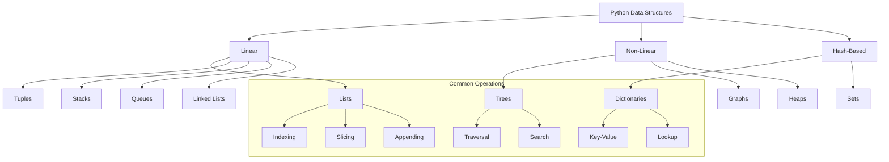

# Lesson 9.2: Python Interview Preparation

## Navigation
- [← Back to Module Overview](./README.md)
- [Previous Lesson ←](./9.1-sql-interview-preparation.md)
- [Next Lesson →](./9.3-system-design-interviews.md)

## Learning Objectives

- Master Python programming fundamentals for technical interviews
- Understand data structures and algorithms in Python
- Learn problem-solving strategies and coding patterns
- Develop efficient coding practices and optimization techniques

## Key Concepts

### Python Fundamentals
- Data types and variables
- Control structures
- Functions and modules
- Object-oriented programming
- Exception handling
- File I/O operations

### Data Structures
- Lists, tuples, and sets
- Dictionaries and hash tables
- Stacks and queues
- Linked lists
- Trees and graphs
- Heaps and priority queues

### Algorithms
- Sorting algorithms
- Searching algorithms
- Graph algorithms
- Dynamic programming
- Greedy algorithms
- Recursion and backtracking

## Practice Problems

### Basic to Intermediate
1. String manipulation
2. List operations
3. Dictionary usage
4. Basic algorithms
5. File processing

### Advanced
1. Complex data structures
2. Algorithm optimization
3. System design problems
4. Concurrency and threading
5. Memory management

## Interview Tips

### Problem-Solving Approach
1. Read and understand the problem
2. Plan your solution
3. Write clean, efficient code
4. Test your solution
5. Optimize if needed

### Coding Best Practices
- Write readable, maintainable code
- Use appropriate data structures
- Handle edge cases
- Consider time and space complexity
- Document your code

## Resources

### Online Platforms
- LeetCode Python problems
- HackerRank Python challenges
- CodeSignal
- CodeWars

### Books and Documentation
- "Python Cookbook" by David Beazley
- "Effective Python" by Brett Slatkin
- Python official documentation
- "Cracking the Coding Interview" Python section

### Practice Tools
- Python REPL
- Jupyter Notebooks
- Online Python editors

## Next Steps

1. Complete coding challenges
2. Review and refactor solutions
3. Study algorithm complexity
4. Practice system design
5. Mock interview preparation

## Additional Notes

- Focus on Python-specific features and idioms
- Learn to write efficient, Pythonic code
- Practice explaining your solutions
- Build a portfolio of solved problems
- Stay updated with Python best practices 