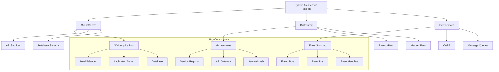

# Lesson 9.3: System Design Interviews

## Navigation
- [← Back to Module Overview](./README.md)
- [Previous Lesson ←](./9.2-python-interview-preparation.md)
- [Next Lesson →](./9.4-behavioral-interview-preparation.md)

## Learning Objectives

- Master the fundamentals of system design for technical interviews
- Understand distributed systems concepts and scalability principles
- Learn to design scalable, reliable, and maintainable systems
- Develop problem-solving strategies for system design challenges

## Key Concepts

### System Design Fundamentals
- Scalability principles
- Availability and reliability
- Performance optimization
- Security considerations
- Data consistency
- System architecture patterns

### Distributed Systems
- Distributed computing concepts
- Load balancing
- Caching strategies
- Database sharding
- Microservices architecture
- Event-driven systems

### Design Patterns
- Client-server architecture
- Peer-to-peer systems
- Master-slave architecture
- Event sourcing
- CQRS pattern
- Service-oriented architecture

## Practice Problems

### Basic to Intermediate
1. URL shortener design
2. Rate limiter implementation
3. Key-value store design
4. Chat application architecture
5. File storage system

### Advanced
1. Distributed cache system
2. Real-time analytics platform
3. Social media feed system
4. Payment processing system
5. Search engine architecture

## Interview Tips

### Problem-Solving Approach
1. Gather requirements
2. Define system scope
3. Design high-level architecture
4. Dive into components
5. Discuss trade-offs
6. Consider scaling

### Common Pitfalls to Avoid
- Over-engineering solutions
- Ignoring non-functional requirements
- Missing important components
- Not considering failure scenarios
- Poor communication of design decisions

## Resources

### Online Platforms
- System Design Primer
- High Scalability blog
- Martin Fowler's blog
- InfoQ architecture articles

### Books and Documentation
- "System Design Interview" by Alex Xu
- "Building Microservices" by Sam Newman
- "Designing Data-Intensive Applications" by Martin Kleppmann
- "Scalability Rules" by Martin L. Abbott

### Practice Tools
- Draw.io for architecture diagrams
- System design templates
- Mock interview platforms

## Next Steps

1. Study system design fundamentals
2. Practice designing various systems
3. Review real-world architectures
4. Participate in mock interviews
5. Build a portfolio of system designs

## Additional Notes

- Focus on scalability and reliability
- Consider trade-offs in design decisions
- Learn to communicate technical concepts clearly
- Stay updated with latest architecture patterns
- Practice drawing architecture diagrams 