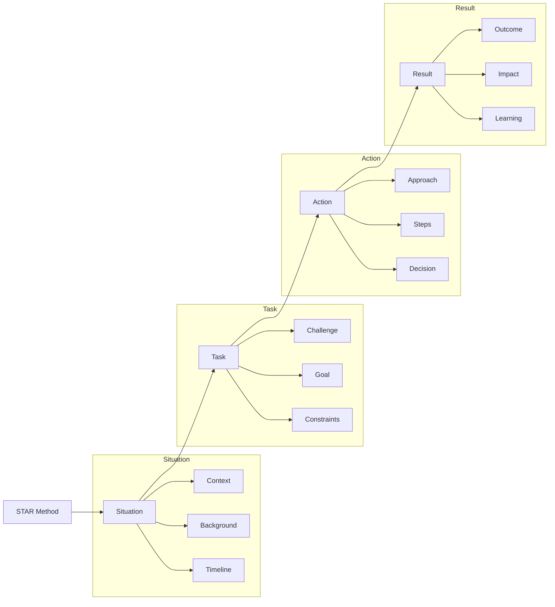

# Lesson 9.4: Behavioral Interview Preparation

## Navigation
- [← Back to Module Overview](./README.md)
- [Previous Lesson ←](./9.3-system-design-interviews.md)
- [Next Lesson →](./9.5-communication-skills.md)

## Learning Objectives

- Master the STAR method for behavioral interviews
- Understand common behavioral interview questions
- Learn to structure compelling responses
- Develop effective communication skills
- Build a portfolio of professional experiences

## Key Concepts

### STAR Method
- Situation: Set the context
- Task: Describe the challenge
- Action: Explain your approach
- Result: Share the outcome

### Common Behavioral Topics
- Leadership and teamwork
- Problem-solving
- Conflict resolution
- Communication skills
- Project management
- Adaptability
- Technical challenges
- Career goals

### Response Structure
- Clear and concise answers
- Specific examples
- Quantifiable results
- Personal growth reflection
- Future application

## Practice Questions

### Common Questions
1. Tell me about a challenging project
2. How do you handle tight deadlines?
3. Describe a conflict at work
4. What's your biggest failure?
5. How do you learn new technologies?

### Technical Context
1. How do you handle technical disagreements?
2. Describe a complex technical problem
3. How do you mentor others?
4. Tell me about a project you're proud of
5. How do you stay updated with technology?

## Interview Tips

### Preparation Strategy
1. Review your experiences
2. Prepare STAR responses
3. Practice with mock interviews
4. Record and review responses
5. Get feedback from peers

### Common Pitfalls to Avoid
- Vague or general responses
- Negative focus
- Lack of specific examples
- Poor time management
- Inconsistent messaging

## Resources

### Online Platforms
- Glassdoor interview questions
- LinkedIn interview guides
- CareerCup
- InterviewBit

### Books and Guides
- "Cracking the Coding Interview" behavioral section
- "The STAR Interview Method Guide"
- "Behavioral Interview Questions and Answers"
- "Technical Interview Guide"

### Practice Tools
- Mock interview platforms
- Video recording tools
- Response templates
- Feedback forms

## Next Steps

1. Create STAR responses for common questions
2. Practice with mock interviews
3. Record and review responses
4. Get feedback from peers
5. Refine your answers

## Additional Notes

- Focus on positive outcomes
- Be specific and detailed
- Show growth and learning
- Demonstrate soft skills
- Stay authentic and honest 