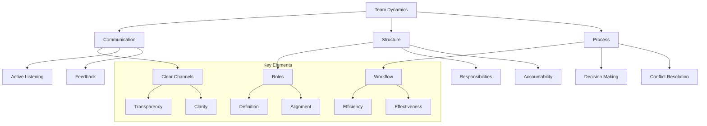

# Lesson 9.6: Team Collaboration

## Navigation
- [← Back to Module Overview](./README.md)
- [Previous Lesson ←](./9.5-communication-skills.md)
- [Next Lesson →](./9.7-career-development.md)

## Learning Objectives

- Master effective teamwork principles
- Develop conflict resolution skills
- Learn project management basics
- Enhance collaboration tools usage
- Build strong interpersonal relationships

## Key Concepts

### Teamwork Principles
- Clear communication
- Role definition
- Goal alignment
- Trust building
- Accountability
- Feedback culture

### Conflict Resolution
- Identifying conflicts
- Active listening
- Problem-solving
- Negotiation
- Compromise
- Mediation

### Project Management
- Task organization
- Timeline management
- Resource allocation
- Risk assessment
- Quality control
- Progress tracking

## Practice Areas

### Team Dynamics
1. Team formation
2. Role assignment
3. Goal setting
4. Process establishment
5. Performance evaluation

### Project Workflow
1. Planning and organization
2. Task delegation
3. Progress monitoring
4. Issue resolution
5. Project completion

## Collaboration Tips

### Best Practices
1. Establish clear expectations
2. Maintain open communication
3. Share knowledge effectively
4. Support team members
5. Celebrate achievements
6. Learn from failures

### Common Pitfalls to Avoid
- Poor communication
- Role ambiguity
- Unclear goals
- Lack of accountability
- Ignoring conflicts

## Resources

### Online Platforms
- Project Management Tools
- Collaboration Platforms
- Team Building Resources
- Conflict Resolution Guides

### Books and Guides
- "The Five Dysfunctions of a Team"
- "Crucial Conversations"
- "Project Management for Dummies"
- "Team of Teams"

### Practice Tools
- Project management software
- Communication platforms
- Collaboration tools
- Feedback systems

## Next Steps

1. Join team projects
2. Practice leadership roles
3. Develop conflict resolution skills
4. Learn project management tools
5. Build collaboration experience

## Additional Notes

- Focus on team success
- Develop emotional intelligence
- Practice active listening
- Build trust relationships
- Embrace diverse perspectives 