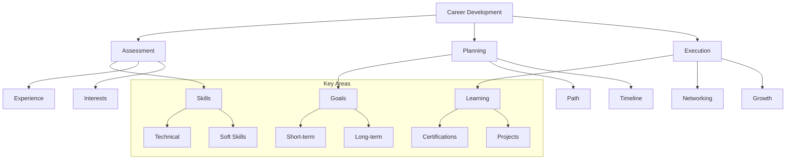

# Lesson 9.7: Career Development

## Navigation
- [← Back to Module Overview](./README.md)
- [Previous Lesson ←](./9.6-team-collaboration.md)
- [Next Module →](../10-capstone-projects-and-industry-integration/README.md)

## Learning Objectives

- Develop a clear career roadmap
- Build a professional network
- Create an effective skill development plan
- Master personal branding
- Learn career advancement strategies

## Key Concepts

### Career Planning
- Goal setting
- Skill assessment
- Career paths
- Industry trends
- Market analysis
- Personal development

### Professional Networking
- Network building
- Relationship management
- Online presence
- Industry events
- Mentorship
- Professional associations

### Skill Development
- Technical skills
- Soft skills
- Industry knowledge
- Leadership abilities
- Business acumen
- Continuous learning

## Practice Areas

### Career Strategy
1. Self-assessment
2. Goal definition
3. Path planning
4. Skill mapping
5. Progress tracking

### Professional Growth
1. Network expansion
2. Skill acquisition
3. Experience building
4. Brand development
5. Career advancement

## Development Tips

### Best Practices
1. Set clear goals
2. Create action plans
3. Track progress
4. Seek feedback
5. Adapt and adjust
6. Stay current

### Common Pitfalls to Avoid
- Lack of planning
- Poor networking
- Skill stagnation
- Limited visibility
- Ignoring feedback

## Resources

### Online Platforms
- LinkedIn Learning
- Professional Networks
- Industry Forums
- Career Development Sites

### Books and Guides
- "The Career Development Handbook"
- "Professional Networking Guide"
- "Personal Branding for Dummies"
- "Career Development Strategies"

### Practice Tools
- Career planning templates
- Network tracking tools
- Skill assessment platforms
- Progress monitoring systems

## Next Steps

1. Create career roadmap
2. Build professional network
3. Develop skill plan
4. Build online presence
5. Track progress

## Additional Notes

- Focus on long-term growth
- Build diverse skills
- Maintain professional relationships
- Stay industry-relevant
- Embrace continuous learning 