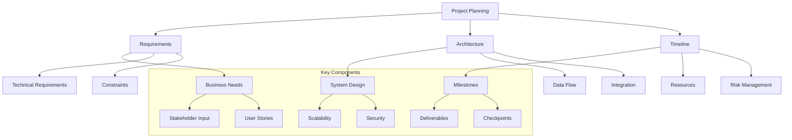

# Lesson 10.1: Project Planning

## Navigation
- [← Back to Module Overview](./README.md)
- [Next Lesson →](./10.2-data-pipeline-design.md)

## Learning Objectives

- Master project planning fundamentals for data engineering solutions
- Learn effective requirements gathering techniques
- Understand system architecture design principles
- Develop project scope and timeline management skills

## Key Concepts

### Project Fundamentals
- Project lifecycle phases
- Requirements gathering
- Scope definition
- Timeline management
- Resource allocation
- Risk assessment

### Architecture Design
- System components
- Data flow patterns
- Integration points
- Scalability considerations
- Security requirements
- Performance optimization

## Practice Areas

### Project Setup
1. Requirements documentation
2. Architecture diagrams
3. Timeline creation
4. Resource planning
5. Risk assessment

### Design Activities
1. System component mapping
2. Data flow documentation
3. Integration planning
4. Security considerations
5. Performance optimization

## Planning Tips

### Best Practices
1. Start with clear objectives
2. Document all requirements
3. Create detailed timelines
4. Identify key stakeholders
5. Plan for contingencies
6. Regular progress tracking

### Common Pitfalls to Avoid
- Unclear requirements
- Incomplete scope definition
- Unrealistic timelines
- Missing dependencies
- Poor resource allocation

## Resources

### Online Platforms
- Project Management Tools
- Architecture Design Tools
- Documentation Templates
- Planning Frameworks

### Books and Guides
- "Data Engineering Projects" by Packt
- "Project Management for Data Engineering"
- "Building Data Pipelines" by James Densmore
- "Data Engineering Best Practices"

### Practice Tools
- Project management software
- Architecture diagram tools
- Timeline management tools
- Risk assessment templates

## Next Steps

1. Create project charter
2. Develop detailed requirements
3. Design system architecture
4. Create project timeline
5. Identify resources and risks

## Additional Notes

- Focus on clear communication
- Document all decisions
- Consider scalability
- Plan for maintenance
- Regular stakeholder updates 