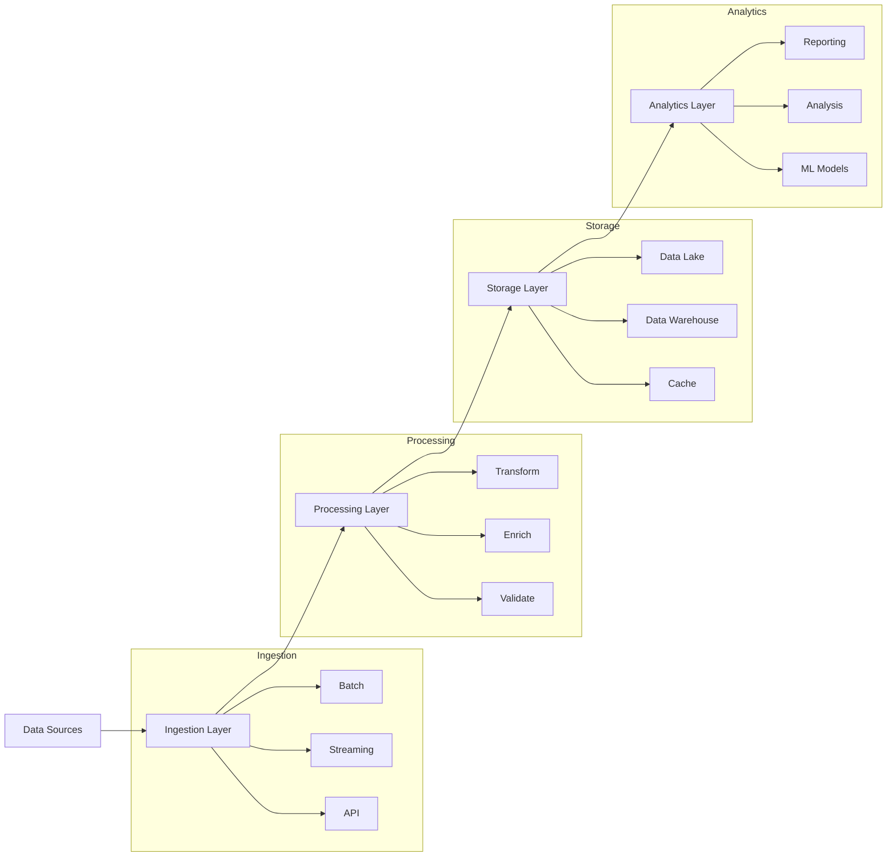

# Lesson 10.2: Data Pipeline Design

## Navigation
- [← Back to Module Overview](./README.md)
- [Previous Lesson ←](./10.1-project-planning.md)
- [Next Lesson →](./10.3-data-ingestion-and-processing.md)

## Learning Objectives

- Master data pipeline architecture design principles
- Understand data flow patterns and integration points
- Learn to design scalable and maintainable pipelines
- Develop documentation and planning skills

## Key Concepts

### Pipeline Architecture
- Data sources and sinks
- Processing stages
- Transformation logic
- Quality checks
- Error handling
- Monitoring points

### Data Flow Patterns
- Batch processing
- Real-time streaming
- Hybrid approaches
- Data lake patterns
- Data warehouse patterns
- Event-driven architectures

## Practice Areas

### Pipeline Planning
1. Source system analysis
2. Data flow mapping
3. Transformation design
4. Quality check planning
5. Monitoring setup

### Integration Design
1. API integration
2. Database connections
3. Message queue setup
4. Event handling
5. Error management

## Design Tips

### Best Practices
1. Start with end-to-end flow
2. Design for scalability
3. Plan for monitoring
4. Consider data quality
5. Document thoroughly
6. Test early and often

### Common Pitfalls to Avoid
- Overcomplicated design
- Missing error handling
- Poor monitoring
- Inadequate testing
- Insufficient documentation

## Resources

### Online Platforms
- Pipeline Design Tools
- Architecture Templates
- Integration Guides
- Best Practices Documentation

### Books and Guides
- "Building Data Pipelines" by James Densmore
- "Data Engineering Best Practices"
- "Streaming Systems" by Tyler Akidau
- "Data Pipeline Design Patterns"

### Practice Tools
- Pipeline design software
- Architecture diagram tools
- Integration testing tools
- Documentation templates

## Next Steps

1. Map data sources
2. Design transformations
3. Plan quality checks
4. Set up monitoring
5. Create documentation

## Additional Notes

- Focus on simplicity
- Consider maintenance
- Plan for scaling
- Document decisions
- Regular reviews 