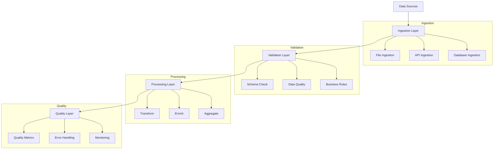

# Lesson 10.3: Data Ingestion and Processing

## Navigation
- [← Back to Module Overview](./README.md)
- [Previous Lesson ←](./10.2-data-pipeline-design.md)
- [Next Lesson →](./10.4-data-storage-and-management.md)

## Learning Objectives

- Master data ingestion techniques and best practices
- Understand data processing requirements and implementation
- Learn to implement quality checks and validation
- Develop error handling and monitoring skills

## Key Concepts

### Data Ingestion
- Source system integration
- Data format handling
- Rate limiting
- Error handling
- Data validation
- Monitoring setup

### Processing Requirements
- Data transformation
- Business logic implementation
- Performance optimization
- Resource management
- Quality assurance
- Error recovery

## Practice Areas

### Implementation
1. Source system setup
2. Ingestion pipeline
3. Processing logic
4. Quality checks
5. Error handling

### Quality Assurance
1. Data validation
2. Performance testing
3. Error monitoring
4. Recovery procedures
5. Documentation

## Implementation Tips

### Best Practices
1. Start with validation
2. Implement error handling
3. Monitor performance
4. Document processes
5. Test thoroughly
6. Plan for scaling

### Common Pitfalls to Avoid
- Poor error handling
- Missing validation
- Performance issues
- Inadequate monitoring
- Insufficient testing

## Resources

### Online Platforms
- Data Ingestion Tools
- Processing Frameworks
- Quality Assurance Tools
- Monitoring Solutions

### Books and Guides
- "Data Engineering Projects" by Packt
- "Building Data Pipelines" by James Densmore
- "Data Quality Handbook"
- "Streaming Systems" by Tyler Akidau

### Practice Tools
- Data ingestion tools
- Processing frameworks
- Quality testing tools
- Monitoring platforms

## Next Steps

1. Set up data sources
2. Implement ingestion
3. Add processing logic
4. Create quality checks
5. Set up monitoring

## Additional Notes

- Focus on reliability
- Consider performance
- Plan for errors
- Monitor quality
- Regular testing 