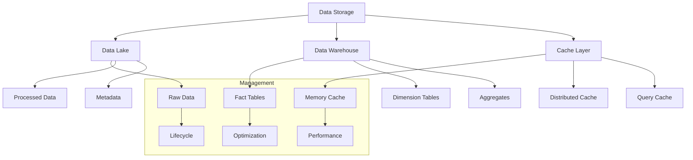

# Lesson 10.4: Data Storage and Management

## Navigation
- [← Back to Module Overview](./README.md)
- [Previous Lesson ←](./10.3-data-ingestion-and-processing.md)
- [Next Lesson →](./10.5-real-time-processing.md)

## Learning Objectives

- Master data storage solutions and optimization techniques
- Understand data modeling principles and implementation
- Learn to implement efficient storage strategies
- Develop data management and maintenance skills

## Key Concepts

### Storage Solutions
- Data lake architecture
- Data warehouse design
- Database optimization
- Caching strategies
- Backup and recovery
- Data lifecycle management

### Data Modeling
- Schema design
- Data normalization
- Performance optimization
- Index management
- Partitioning strategies
- Data versioning

## Practice Areas

### Storage Implementation
1. Storage system setup
2. Data model creation
3. Performance tuning
4. Backup configuration
5. Monitoring setup

### Data Management
1. Schema management
2. Data versioning
3. Access control
4. Performance monitoring
5. Maintenance procedures

## Implementation Tips

### Best Practices
1. Choose appropriate storage
2. Design efficient schemas
3. Implement proper indexing
4. Plan for scaling
5. Regular maintenance
6. Monitor performance

### Common Pitfalls to Avoid
- Poor schema design
- Inefficient indexing
- Missing backups
- Poor monitoring
- Inadequate scaling

## Resources

### Online Platforms
- Storage Solutions
- Data Modeling Tools
- Performance Monitoring
- Management Frameworks

### Books and Guides
- "Data Warehouse Toolkit"
- "Building Data Lakes"
- "Database Design"
- "Storage Management Guide"

### Practice Tools
- Storage management tools
- Data modeling software
- Performance monitoring
- Backup solutions

## Next Steps

1. Design storage architecture
2. Implement data models
3. Set up monitoring
4. Configure backups
5. Create maintenance plan

## Additional Notes

- Focus on scalability
- Consider performance
- Plan for growth
- Regular maintenance
- Monitor usage 