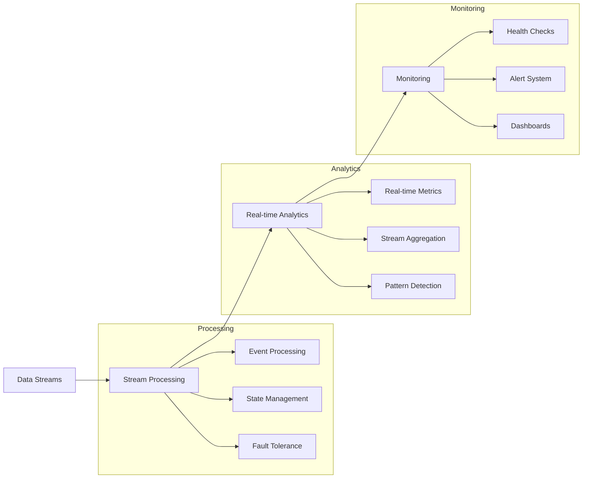

# Lesson 10.5: Real-time Processing

## Navigation
- [← Back to Module Overview](./README.md)
- [Previous Lesson ←](./10.4-data-storage-and-management.md)
- [Next Lesson →](./10.6-security-and-governance.md)

## Learning Objectives

- Master real-time data processing techniques
- Understand streaming architecture design
- Learn to implement monitoring solutions
- Develop real-time analytics skills

## Key Concepts

### Streaming Implementation
- Event processing
- Stream processing
- Real-time analytics
- State management
- Fault tolerance
- Scaling strategies

### Monitoring Solutions
- Performance metrics
- Health checks
- Alert systems
- Log management
- Dashboard creation
- Incident response

## Practice Areas

### Implementation
1. Stream processing setup
2. Analytics implementation
3. Monitoring configuration
4. Alert system setup
5. Dashboard creation

### Quality Assurance
1. Performance testing
2. Reliability checks
3. Latency monitoring
4. Error handling
5. Recovery procedures

## Implementation Tips

### Best Practices
1. Design for scalability
2. Implement fault tolerance
3. Monitor performance
4. Set up alerts
5. Regular testing
6. Document processes

### Common Pitfalls to Avoid
- Poor scalability
- Missing monitoring
- Inadequate testing
- Insufficient documentation
- Poor error handling

## Resources

### Online Platforms
- Stream Processing Tools
- Analytics Platforms
- Monitoring Solutions
- Dashboard Tools

### Books and Guides
- "Streaming Systems" by Tyler Akidau
- "Real-time Analytics"
- "Stream Processing Guide"
- "Monitoring Best Practices"

### Practice Tools
- Stream processing frameworks
- Analytics platforms
- Monitoring tools
- Dashboard builders

## Next Steps

1. Set up stream processing
2. Implement analytics
3. Configure monitoring
4. Create dashboards
5. Test thoroughly

## Additional Notes

- Focus on reliability
- Consider latency
- Plan for scaling
- Monitor performance
- Regular testing 