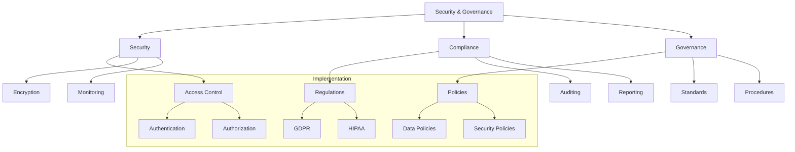

# Lesson 10.6: Security and Governance

## Navigation
- [← Back to Module Overview](./README.md)
- [Previous Lesson ←](./10.5-real-time-processing.md)
- [Next Lesson →](./10.7-testing-and-quality-assurance.md)

## Learning Objectives

- Master data security implementation techniques
- Understand compliance requirements and frameworks
- Learn to implement governance controls
- Develop security monitoring and incident response skills

## Key Concepts

### Security Implementation
- Access control
- Data encryption
- Network security
- Identity management
- Security monitoring
- Incident response

### Governance Framework
- Compliance requirements
- Data policies
- Audit procedures
- Risk management
- Privacy controls
- Documentation standards

## Practice Areas

### Security Setup
1. Access control implementation
2. Encryption configuration
3. Security monitoring
4. Incident response planning
5. Vulnerability assessment

### Governance Implementation
1. Policy development
2. Compliance checks
3. Audit procedures
4. Documentation creation
5. Training programs

## Implementation Tips

### Best Practices
1. Defense in depth
2. Least privilege access
3. Regular audits
4. Incident response plans
5. Employee training
6. Documentation maintenance

### Common Pitfalls to Avoid
- Weak access controls
- Poor encryption
- Missing audits
- Inadequate monitoring
- Insufficient training

## Resources

### Online Platforms
- Security Tools
- Compliance Frameworks
- Governance Templates
- Training Materials

### Books and Guides
- "Data Security Guide"
- "Compliance Handbook"
- "Security Best Practices"
- "Governance Framework Guide"

### Practice Tools
- Security management tools
- Compliance monitoring
- Audit software
- Documentation platforms

## Next Steps

1. Implement security controls
2. Set up compliance monitoring
3. Create governance policies
4. Develop audit procedures
5. Train team members

## Additional Notes

- Focus on prevention
- Regular assessments
- Document everything
- Train regularly
- Stay updated 