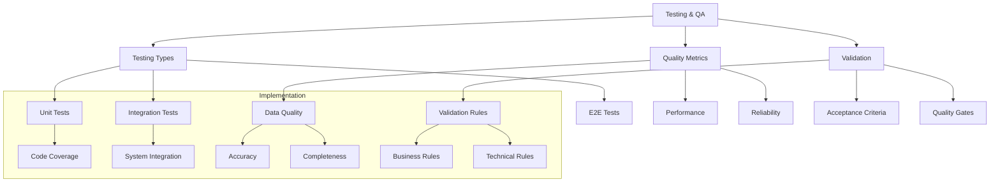

# Lesson 10.7: Testing and Quality Assurance

## Navigation
- [← Back to Module Overview](./README.md)
- [Previous Lesson ←](./10.6-security-and-governance.md)
- [Next Lesson →](./10.8-deployment-and-monitoring.md)

## Learning Objectives

- Master testing strategies for data engineering solutions
- Understand quality metrics and validation techniques
- Learn to implement comprehensive test suites
- Develop quality assurance processes

## Key Concepts

### Testing Strategies
- Unit testing
- Integration testing
- End-to-end testing
- Performance testing
- Load testing
- Regression testing

### Quality Metrics
- Data quality
- Performance metrics
- Reliability measures
- Coverage metrics
- Error rates
- SLA compliance

## Practice Areas

### Test Implementation
1. Test suite setup
2. Test case development
3. Automation framework
4. CI/CD integration
5. Performance testing

### Quality Assurance
1. Quality metrics definition
2. Validation rules
3. Monitoring setup
4. Documentation
5. Review processes

## Implementation Tips

### Best Practices
1. Comprehensive test coverage
2. Automated testing
3. Regular validation
4. Clear documentation
5. Continuous monitoring
6. Regular reviews

### Common Pitfalls to Avoid
- Insufficient testing
- Poor test coverage
- Missing validation
- Inadequate documentation
- Manual processes

## Resources

### Online Platforms
- Testing Frameworks
- Quality Tools
- Automation Platforms
- Documentation Tools

### Books and Guides
- "Data Quality Testing"
- "Test Automation Guide"
- "Quality Assurance Handbook"
- "Testing Best Practices"

### Practice Tools
- Testing frameworks
- Quality monitoring
- Automation tools
- Documentation platforms

## Next Steps

1. Design test strategy
2. Implement test suite
3. Set up automation
4. Create quality gates
5. Document processes

## Additional Notes

- Focus on automation
- Regular testing
- Monitor quality
- Document thoroughly
- Continuous improvement 