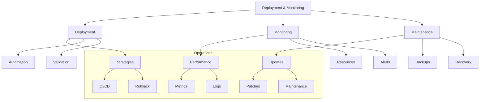

# Lesson 10.8: Deployment and Monitoring

## Navigation
- [← Back to Module Overview](./README.md)
- [Previous Lesson ←](./10.7-testing-and-quality-assurance.md)

## Learning Objectives

- Master deployment strategies for data engineering solutions
- Understand monitoring tools and techniques
- Learn to implement maintenance procedures
- Develop operational excellence practices

## Key Concepts

### Deployment Strategies
- Continuous deployment
- Blue-green deployment
- Canary releases
- Rolling updates
- Rollback procedures
- Version control

### Monitoring Tools
- Performance monitoring
- Resource utilization
- Error tracking
- Alert management
- Log analysis
- Health checks

## Practice Areas

### Deployment Setup
1. CI/CD pipeline
2. Deployment automation
3. Environment configuration
4. Validation checks
5. Rollback procedures

### Monitoring Implementation
1. Metrics collection
2. Alert configuration
3. Log management
4. Dashboard creation
5. Health checks

## Implementation Tips

### Best Practices
1. Automated deployments
2. Comprehensive monitoring
3. Regular maintenance
4. Clear procedures
5. Incident response
6. Documentation

### Common Pitfalls to Avoid
- Manual deployments
- Missing monitoring
- Poor maintenance
- Inadequate logging
- No rollback plan

## Resources

### Online Platforms
- Deployment Tools
- Monitoring Platforms
- Log Management
- Alert Systems

### Books and Guides
- "Continuous Deployment"
- "Monitoring Best Practices"
- "Site Reliability Engineering"
- "DevOps Handbook"

### Practice Tools
- CI/CD platforms
- Monitoring tools
- Log analyzers
- Alert managers

## Next Steps

1. Set up CI/CD
2. Configure monitoring
3. Implement logging
4. Create alerts
5. Document procedures

## Additional Notes

- Focus on automation
- Regular maintenance
- Monitor everything
- Plan for failures
- Document procedures 